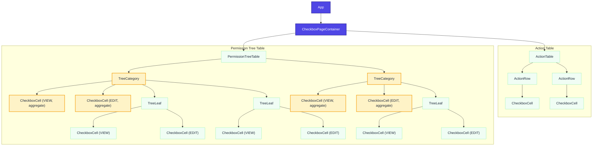
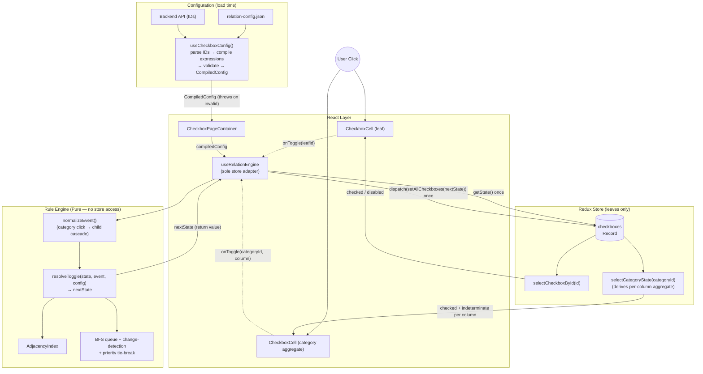

# Checkbox Relation Engine — Design Document v3

**Status:** Draft for review
**Date:** 2026-07-13
**Type:** New Module Design (Revised — supersedes v2)
**Changes from v2:** Pure engine core; reason-based disabled state; categories/columns formalized as derived entities; `REQUIRES` reclassified; `CONDITIONAL` replaced by a universal `condition` field; discriminated-union rule types; ID grammar specified; termination invariant documented; worked example and accessibility sections added.

---

### 1. Context & Scope

* **Background:** The system manages two distinct tables of checkboxes. The first table contains rows with a single ACTION column. The second table contains rows with VIEW and EDIT columns, structured as a tree table (rows grouped under collapsible categories). The backend sends checkbox IDs in a dot-delimited format (grammar defined in §4.1). Defining relations that target entire columns or subtrees by hand is impractical at scale, so this design introduces Target Expressions (a mini-DSL) that resolve to concrete leaf IDs at config-load time.
* **Goals:**
  * **Two-Table Layout:** Support an ACTION table (flat) and a VIEW/EDIT permission tree table (hierarchical).
  * **Backend ID Parsing:** Derive table, column, category path, and leaf identity from dot-delimited IDs against an explicit grammar.
  * **Tree Table UX:** Collapsible categories with per-column indeterminate (tri-state) checkbox rendering, fully derived from leaf state. Categories and column headers are **never** stored state (§4.4).
  * **Target Expressions:** Allow relation rules to reference dynamic groups (`$COLUMN`, `$SUBTREE`, `$CHILDREN`, `$MATCH`, `$ALL`, `$SELECTOR`), compiled and validated at config load (§4.2).
  * **Disabled State:** Track disablement as a first-class, *reason-based* property (`disabledBy: string[]`) so that multiple rules can independently hold and release locks on the same target (§4.5).
  * **Chained Grouping:** A single sourceId can declare a `relationships` array to handle complex multi-rule triggers cleanly.
  * **Deterministic, testable core:** The rule engine is a pure function of `(state, event, compiledConfig)`; all store access lives in one thin adapter (§2).
* **Non-Goals:**
  * Server-side rule evaluation (all logic is client-side).
  * Undo/redo history.
  * Virtual scrolling. *(Consequence acknowledged in §6: very large cascades pay full DOM cost; revisit if trees exceed ~1,000 visible leaves.)*
  * Visual relation graph editor.
  * "Exactly one" / "at least N" group constraints. `MUTUAL_EXCLUSIVE` guarantees *at most one* checked, not *exactly one*. True radio-group semantics are out of scope for v3 and tracked in §7.

### 2. Architecture & Component Boundaries

* **Component Hierarchy:**
  The app uses a Smart/Dumb component architecture. The `CheckboxPageContainer` (Smart) initializes the Redux slice from backend data, runs config compilation once via `useCheckboxConfig()`, and obtains a stable `handleToggle` from `useRelationEngine(compiledConfig)`. It passes data down to the `ActionTable` (Dumb) and `PermissionTreeTable` (Dumb). The `PermissionTreeTable` uses `TreeCategory` for grouping rows (expand/collapse remains local component state) and `TreeLeaf` for individual rows. Each `TreeLeaf` renders one `CheckboxCell` per column (VIEW, EDIT). Each `TreeCategory` renders one **aggregate** `CheckboxCell` per column (VIEW, EDIT), whose checked/indeterminate state is derived by selector — mirroring the two-column structure of the leaves beneath it.
* **Hook & State Strategy:**
  * `useCheckboxConfig()`: Loads JSON config, parses backend IDs against the grammar (§4.1), compiles and **validates** all Target Expressions (§4.2), and builds the `CompiledConfig` (AdjacencyIndex + resolved rule list). Throws at load time on any validation failure — a config typo is a boot error, never a silent runtime no-op.
  * `useRelationEngine(compiledConfig)`: The **only** module that touches the store for writes. Returns a stable `handleToggle(id)` that: (1) reads current state once, (2) normalizes the click into a `ToggleEvent` (leaf toggle, or category toggle expanded per §4.4), (3) calls the pure `resolveToggle(state, event, compiledConfig)`, (4) dispatches a single `setAllCheckboxes(nextState)`.
  * `useTreeStructure()`: Normalizes backend data into UI `TreeNode[]`.
  * **Engine purity contract:** `resolveToggle` is a pure function — no store access, no dispatch, no side effects. It receives state as an argument and returns the next state. This is what makes the QA strategy in §6 (unit tests over plain objects and simulated adjacency maps) actually possible, and it preserves the single-commit render behavior: exactly one dispatch per user interaction regardless of cascade size.
  * **Single write path:** `handleToggle` is the sole writer to the checkbox slice. `setAllCheckboxes` is not exported for use elsewhere. This is load-bearing: invariant-style relations (`INVERSE`, `BIDIRECTIONAL`) only hold if every mutation flows through the engine.
  * **State:** Checkbox state is a Redux slice of shape `Record<LeafId, CheckboxValue>`, **leaves only** — categories and column headers never appear as keys (§4.4). Memoized selectors `selectCheckboxById(id)` and `selectCategoryState(categoryId)` prevent unnecessary re-renders. `selectCategoryState` derives its child-ID list internally from the compiled tree structure (stable reference), rather than accepting a caller-supplied `childIds` array — an inline array argument would defeat memoization on every render.

### 3. Essential Diagrams

#### Component Hierarchy



#### State & Data Flow



*Note the boundary: everything inside **Engine** is pure and synchronous. `useRelationEngine` owns the two store touches (one read, one write) per interaction. Target Expressions never reach the engine at runtime — they are compiled to concrete leaf-ID lists inside `useCheckboxConfig()`.*

### 4. Interfaces & Contracts

#### 4.1 Backend ID Grammar

All checkbox IDs are dot-delimited and parsed against this grammar:

```
ActionId     ::= "action" "." leafKey
PermissionId ::= "perm" "." categoryPath "." column
categoryPath ::= segment ("." segment)*        // arbitrary depth ≥ 1
column       ::= "view" | "edit"
segment, leafKey ::= [a-zA-Z0-9_-]+
```

**Examples:** `action.export_csv` · `perm.reports.view` · `perm.reports.financial.quarterly.edit`

Parsing rules: the first segment selects the table; for permission IDs the **last** segment is always the column and everything between is the category path (this is what makes arbitrary-depth nesting unambiguous). `$SUBTREE(perm.reports)` matches any permission ID whose category path has `reports` as a prefix, at any depth; `$CHILDREN(perm.reports)` matches only IDs whose category path is exactly one segment deeper.

> ⚠️ **Action item before implementation:** this grammar is written from the v2 doc's description, not from a real payload. Validate it against 3–5 actual backend IDs — in particular whether depth is truly arbitrary and whether the column is reliably the final segment — before building the parser.

#### 4.2 Target Expressions

| Expression | Meaning | Matching semantics |
|---|---|---|
| `$COLUMN(view)` / `$COLUMN(edit)` | Every leaf ID in that column of the permission table | Exact column-segment match |
| `$SUBTREE(path)` | Every leaf under `path`, any depth | Category-path **prefix** match on whole segments |
| `$CHILDREN(path)` | Leaves exactly one level below `path` | Prefix match + depth check |
| `$MATCH(glob)` | Leaves whose full ID matches a **glob** pattern (`*` = any run of chars within a segment, `**` = across segments) | Glob, not regex — deliberate; see §7 |
| `$ALL` | Every leaf in **both** tables | Unconditional. Because of its blast radius, `$ALL` is only legal on the `targets` side, never as a `sourceId` |
| `$SELECTOR(name)` | A named expression from the config's `selectors` block | Resolved by name; selectors may **not** reference other selectors (prevents circular definitions by construction) |

**Load-time validation (all failures throw):** unknown expression syntax; unknown `$SELECTOR` name; an expression resolving to **zero** leaves; `$ALL` used as a source; a rule whose source set intersects its own target set for a cascade type (self-loop).

**Expression as `sourceId`:** allowed, and expanded *statically* at load into N concrete rules — one per resolved leaf. Expressions never exist at runtime; the engine only ever sees concrete leaf IDs.

#### 4.3 Relation Primitives

The system provides **12 primitives** (11 distinct behaviors + 1 readability alias) in three categories, plus a universal `condition` field available on every rule. Complex behaviors are achieved by composing these primitives within a `relationships` array. *(v2's `CONDITIONAL` is removed: it named no target behavior of its own and duplicated what `conditionId` already did. Any rule can now be conditional.)*

##### A. Checked-State Relations — *source's `checked` drives targets' `checked`*

* **`CASCADES_CHECK`** — When the source becomes checked, all targets are checked. *(Select-all patterns; checking a parent that must check its children.)*
* **`CASCADES_UNCHECK`** — When the source becomes unchecked, all targets are unchecked.
* **`CASCADES_BOTH`** — Targets mirror the source in both directions.
* **`GROUP_ALL`** — **Alias** of `CASCADES_BOTH`; exists purely for config readability in parent-child grouping. Compiles to the identical rule.
* **`MUTUAL_EXCLUSIVE`** — When the source becomes checked, all targets are unchecked. Guarantees *at most one* checked in the group — not *exactly one*; a user may uncheck everything (see Non-Goals).
* **`INVERSE`** — Targets hold the opposite boolean state of the source. *(Invariant depends on the single-write-path rule in §2.)*
* **`BIDIRECTIONAL`** — Symmetric `CASCADES_BOTH`. **Declaring it on A→B auto-registers the reverse edge B→A in the AdjacencyIndex**; do not also declare the mirror rule manually (the compiler warns on redundant symmetric declarations).

##### B. Dependency Relations — *targets' state drives the **source*** *(direction is deliberately inverted — that's the point of the category)*

* **`REQUIRES`** — While any target is unchecked: the source is unchecked and disabled (reason = this rule's id). When all targets become checked: the lock is released. Whether the source's previous checked state is then **restored** is controlled by `restoreCheckedOnSatisfy` (default `false` — the source merely becomes checkable again; `true` re-checks it if it was checked when the lock engaged).
  * **Re-evaluation:** `REQUIRES` rules are indexed by their *targets*; any change to a target's checked state re-evaluates the rule. This is what makes it order-independent — checking dependencies after the dependent works the same as before.
  * **Use case:** an EDIT permission that requires its sibling VIEW; a dependent feature requiring prerequisite grants.

##### C. Disabled-State Relations — *source's `checked` drives targets' `disabledBy`*

* **`DISABLES_ON_CHECK`** — While the source is checked, each target's `disabledBy` contains this rule's id; when the source unchecks, the reason is removed. Optional `forceCheckedValue` pins targets to a value while locked. *("Opt out of all communications" greys out individual preferences.)*
* **`DISABLES_ON_UNCHECK`** — Mirror trigger: locks targets while the source is unchecked.
* **`ENABLES_ON_CHECK`** / **`ENABLES_ON_UNCHECK`** — Removes **this rule's own reason** from targets' `disabledBy` on the trigger. An enable rule cannot remove reasons held by other rules — enabling is releasing your own lock, not overriding someone else's (§4.5).

##### Universal `condition` field

Any rule may declare `condition`, evaluated against current checked state at fire time:

```typescript
type Condition =
  | string                      // shorthand: { all: [id] }
  | { all: LeafId[] }
  | { any: LeafId[] }
  | { not: Condition };
```

**Re-evaluation:** conditioned rules are indexed by their condition's referenced IDs as well as their source. When a condition input changes, the rule re-fires against the source's *current* state — so "check A while B is off, then check B" behaves identically to the reverse order.

#### 4.4 Categories & Column Headers Are Derived, Never Stored

Categories and column headers have **no `CheckboxValue`**, never appear in the Redux slice, and are **not nodes in the AdjacencyIndex**.

* **Rendering:** `selectCategoryState(categoryId)` derives, per column: `checked` (all descendant leaves in that column checked), `indeterminate` (some checked), `disabled` (all descendant leaves disabled).
* **Clicking a category aggregate cell:** `handleToggle` does not feed the category ID to the engine as if it were a leaf. It normalizes the click into a `ToggleEvent`: compute the target boolean (checked/indeterminate → uncheck all; unchecked → check all), producing the equivalent of a cascade over that category's descendant leaves in that column. BFS proceeds from those leaves normally.
* **In config:** a category path is legal inside `$SUBTREE(...)` / `$CHILDREN(...)` expressions (where it resolves to leaves at load time), but a bare category ID is **not** a legal `sourceId` or target — validation rejects it. This closes v2's ambiguity where category IDs flowed into the engine with no defined state to read.
* There is no stored "select all" header checkbox. If a column header renders a select-all control, it is the same derived-aggregate pattern applied to `$COLUMN(...)` scope.

#### 4.5 Disabled State: Reasons, Not a Flag

```typescript
interface CheckboxValue {
  checked: boolean;
  disabledBy: string[];   // rule ids currently holding a lock; disabled ⟺ length > 0
}
```

* Multiple rules can independently lock the same target; each releases only its own reason. Last-write-wins clobbering between unrelated rules is structurally impossible.
* An external/initial lock (e.g., a mandatory permission from the backend) uses the reserved reason `"@initial"`, which no rule can remove.
* **Cascade policy:** engine-driven cascades **skip** any leaf whose `disabledBy` is non-empty — a disabled checkbox resists both user clicks *and* rule-driven changes. The single exception is the rule that owns the lock: `forceCheckedValue` on a `DISABLES_ON_*` rule may set its own locked targets. *(Chosen because the dominant use case is "locked = frozen"; if a future case needs cascade-through-disabled, add an explicit `piercesDisabled` flag rather than changing the default — see §7.)*
* Serialization note: `disabledBy` is a plain array (not a `Set`) to stay Redux-serializable; rule ids are unique so array semantics suffice.

#### 4.6 TypeScript Definitions

```typescript
type ColumnType = 'view' | 'edit';
type LeafId = string;                 // conforms to grammar in §4.1

type TargetExpression =
  | `$COLUMN(${ColumnType})`
  | `$SUBTREE(${string})`
  | `$CHILDREN(${string})`
  | `$MATCH(${string})`
  | `$ALL`
  | `$SELECTOR(${string})`;

type TargetRef = LeafId | TargetExpression;

type CascadeType  = 'CASCADES_CHECK' | 'CASCADES_UNCHECK' | 'CASCADES_BOTH' | 'GROUP_ALL';
type SymmetryType = 'MUTUAL_EXCLUSIVE' | 'INVERSE' | 'BIDIRECTIONAL';
type DisableType  = 'DISABLES_ON_CHECK' | 'DISABLES_ON_UNCHECK' | 'ENABLES_ON_CHECK' | 'ENABLES_ON_UNCHECK';
type RelationType = CascadeType | SymmetryType | 'REQUIRES' | DisableType;

interface RelationBase {
  id: string;                         // REQUIRED (was optional in v2): reasons in
                                      // disabledBy and validation errors need it
  targets: TargetRef[];
  condition?: Condition;
  priority?: number;                  // see §4.7
}

// Discriminated union: per-type fields are compile errors elsewhere
type RelationDefinition =
  | (RelationBase & { type: CascadeType | SymmetryType })
  | (RelationBase & { type: 'REQUIRES'; restoreCheckedOnSatisfy?: boolean })
  | (RelationBase & { type: DisableType; forceCheckedValue?: boolean });

interface RelationRule {
  sourceId: TargetRef;               // expression sources expand statically at load
  relationships: RelationDefinition[];
}

interface CheckboxConfig {
  version: string;
  selectors?: { name: string; expression: TargetExpression }[]; // no selector-to-selector refs
  relations: RelationRule[];
}

interface CheckboxValue {
  checked: boolean;
  disabledBy: string[];
}
```

#### 4.7 Priority Semantics

`priority` is an integer, default `0`; higher wins. A direct user toggle has implicit priority `0`. Within one BFS pass, if two rules write conflicting values to the same leaf, the higher-priority write wins; on a tie, the write from the rule closer to the originating event (shallower BFS depth) wins; on a full tie, config declaration order decides — deterministic in all cases. *(This replaces v2's undefined "priority 1 manual batch toggles" reference.)*

#### 4.8 Worked Example — "EDIT implies VIEW"

The canonical relation this system exists to express, end to end:

```json
{
  "version": "3.0",
  "selectors": [
    { "name": "allEdit", "expression": "$COLUMN(edit)" }
  ],
  "relations": [
    {
      "sourceId": "$SELECTOR(allEdit)",
      "relationships": [
        {
          "id": "edit-requires-view",
          "type": "REQUIRES",
          "targets": ["$MATCH(perm.**.view)"],
          "restoreCheckedOnSatisfy": false
        },
        {
          "id": "edit-checks-view",
          "type": "CASCADES_CHECK",
          "targets": ["$MATCH(perm.**.view)"]
        }
      ]
    }
  ]
}
```

> **Compiler note — relative target resolution:** when an expression source expands, each expanded rule's targets are resolved **relative to that source's own path** — `perm.reports.edit` pairs with `perm.reports.view`, not with every view leaf. Concretely: relative resolution applies when the source is an expression *and* a target expression shares the source's grammar shape; the compiler substitutes the source's category path before matching.

Resulting behavior: checking any EDIT auto-checks its sibling VIEW (`CASCADES_CHECK`); while a VIEW is unchecked, its sibling EDIT is unchecked and locked (`REQUIRES`); unchecking a VIEW therefore force-releases and disables its EDIT. This example doubles as the acceptance test for the primitive set — and it demonstrates rule chaining (`REQUIRES` firing off a state change that `CASCADES_CHECK` caused).

### 5. Migration & Execution Strategy

* **Rollout Plan:**
  1. **Grammar first:** confirm §4.1 against real backend payloads; implement and unit-test the ID parser.
  2. Implement the Target Expression compiler + load-time validation (§4.2), including static expansion of expression sources and relative target resolution.
  3. Implement the pure `resolveToggle(state, event, compiledConfig)` with the change-detection BFS and priority tie-breaking (§4.7, §6) — fully tested against plain objects before any React work.
  4. Introduce the Redux slice (`Record<LeafId, CheckboxValue>` with `disabledBy`) and the `useRelationEngine` adapter (single read, single dispatch per interaction).
  5. Mount the UI (ActionTable & PermissionTreeTable) with all category/header aggregates derived purely from selectors; wire category clicks through event normalization (§4.4).
  6. **Parity audit before cutover:** enumerate every relation the *current production system* expresses and encode each in the new config. Any relation that cannot be expressed blocks the cutover — this audit, not the primitive count, is the actual test of coverage.
* **Interoperability:**
  The new `CheckboxConfig` completely replaces old logic. Target Expressions are evaluated statically at config load; nothing DSL-shaped survives to runtime. Backend ID formats remain untouched; the frontend parser adapts them.

### 6. Performance & Quality Assurance

* **Termination invariant (load-bearing):** a leaf is re-enqueued in the BFS **only if its newly computed `CheckboxValue` differs from its current value** (`checked` *and* `disabledBy` compared). This is what makes the intentionally circular primitives (`INVERSE`, `BIDIRECTIONAL`) converge in one pass instead of oscillating: A flips B, B's rule recomputes A, A's value is already correct, nothing is enqueued. A hard iteration cap of `10 × leafCount` remains as a backstop; hitting it throws with the offending cycle's trace in dev builds.
* **Optimization:**
  * **Single commit:** one `getState()` and one `dispatch` per user interaction regardless of cascade size; React renders once against the final state.
  * **O(1) rule lookup, O(affected) propagation:** the DSL compiles away at load; per-node rule lookup is a map hit. Honest framing: a "select all" over N leaves still does O(N) work and O(N) DOM updates — the algorithm is efficient but not magic, and virtual scrolling is an explicit non-goal. Budget: a 1,000-leaf full-column cascade completes engine work in under 16 ms.
  * **Selector stability:** `selectCategoryState` sources its child list from the compiled tree (stable reference); no caller-supplied arrays that would break memoization.
* **Testing Strategy:**
  * Pure-function unit tests of `resolveToggle` over plain-object state and simulated adjacency maps — no store, no React. *(Enabled by the purity contract in §2; not actually possible under v2's store-coupled design.)*
  * Property test: for random configs and random click sequences, the engine terminates and is idempotent (replaying the final event changes nothing).
  * Tie-breaking: a higher-priority `MUTUAL_EXCLUSIVE` overriding a lower-priority cascade writing to the same leaf; tie → BFS-depth → declaration-order determinism.
  * Chaining at depth: `CASCADES_CHECK → DISABLES_ON_CHECK → CASCADES_UNCHECK` propagating correctly to **arbitrary** depth *(v2 said "infinite depths" — a system whose job includes guaranteed termination should not promise infinite propagation)*.
  * Disabled semantics: cascades skip locked leaves; `forceCheckedValue` pierces only its own lock; two rules locking one leaf release independently; `ENABLES_*` cannot release a foreign reason; `"@initial"` is irrevocable.
  * `REQUIRES` order-independence: dependency checked before vs. after the dependent yields identical end states; `restoreCheckedOnSatisfy` tested both ways.
  * `condition` re-evaluation: a condition input flipping after the source toggles re-fires the rule.
  * Loader validation: every failure class in §4.2 throws with an actionable message.
  * The §4.8 example as an end-to-end acceptance test.
* **Accessibility (new — tri-state trees have hard requirements):**
  * Category aggregate cells render `aria-checked="mixed"` when indeterminate; the native `indeterminate` DOM property is set for visual parity.
  * The tree table uses `role="treegrid"` with arrow-key row/cell navigation and Space to toggle; expand/collapse on Left/Right per the ARIA treegrid pattern.
  * Disabled cells expose `aria-disabled` and, where a human-readable reason exists, an `aria-describedby` tooltip naming *why* (derived from a rule-id → label map).
  * When one click cascades to off-screen checkboxes, an `aria-live="polite"` region announces a summary ("12 permissions updated"). The exact UX of cascade signaling for sighted users is tracked in §7.

### 7. Open Questions & Future Considerations

* **Q: Pre-validation of accidental conflicting cycles at config load?**
  * *Context:* A targets B and B targets A with *conflicting* rules (e.g., `CASCADES_CHECK` vs `INVERSE`). Runtime is safe — change-detection BFS + iteration cap guarantee termination, and priority picks a deterministic winner — but the config author gets no warning that their rules fight. A load-time static pass (detect cycles whose composed rules cannot reach a fixed point) would surface this at authoring time.
  * *Status:* Open; the runtime guard is sufficient for v3, static analysis is a fast-follow.
* **Q: Dynamic external state in conditions?**
  * *Context:* e.g., a `condition` referencing an RBAC role fetched from the server, not a checkbox. Would require conditions over an injected context object, plus a re-evaluation trigger when that context changes.
  * *Status:* Open. The `Condition` type was shaped so `{ all: [...] }` could later admit non-checkbox predicates without breaking existing configs.
* **Q: Regex in `$MATCH`?**
  * *Decision for v3:* **No — glob only.** Globs cover the path-shaped ID space, are trivially analyzable for load-time validation, and avoid pathological-regex performance risk. Revisit only with a concrete case globs cannot express.
* **Q: True radio-group semantics ("exactly one" / "at least N")?**
  * *Context:* `MUTUAL_EXCLUSIVE` is at-most-one by design. If a product case demands a non-emptiable group, that is a new constraint primitive (likely `GROUP_MIN(n)`), not a patch to the existing one.
* **Q: Cascade UX signaling for sighted users?**
  * *Context:* a single click may visibly change dozens of distant checkboxes. The `aria-live` summary (§6) covers assistive tech; whether sighted users need a visual affordance (flash animation, toast, changed-count badge) is a design question deliberately not prescribed here.
* **Q: `piercesDisabled` escape hatch?**
  * *Context:* §4.5 fixes "cascades skip locked leaves" as the default. If a real case ever needs an admin-grade cascade that overrides locks, add an explicit opt-in flag per rule rather than weakening the default.
