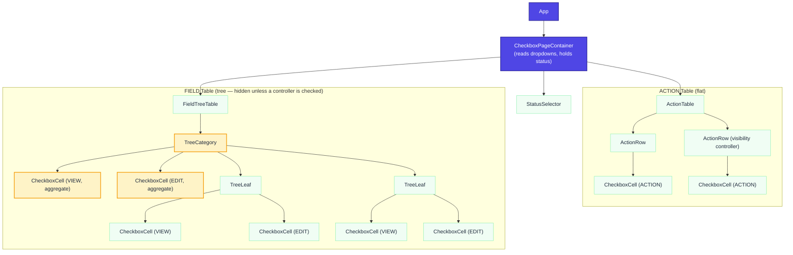
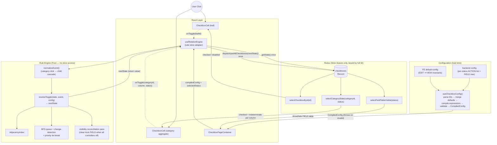

# Checkbox Relation Engine — Design Document v4

**Status:** Draft for review
**Date:** 2026-07-13
**Type:** Module Design (Revised — supersedes v3)
**Changes from v3:**
* Engine **rehomed** as the interactive core of the larger **rule-set CRUD** module; scope narrowed to the *create rule set* page (§1).
* **ID grammar replaced**: slash-delimited, fixed-position `RESOURCE_NAME / STATUS / TYPE / PATH`. `PATH` is now **opaque payload** for a downstream module and carries **no hierarchy** (§4.1).
* **STATUS** added as a first-class dimension: a per-resource label list that swaps visible content; relations **never cross statuses** (§1, §4.3).
* **Backend Config Contract** formalized (§4.2): ACTION list + FIELD tree, per-status, each checkbox `{ id, isChecked, isDisabled }`.
* **Two tables restructured**: one flat **ACTION** table and one hierarchical **FIELD** tree whose leaves each carry a **VIEW** and an **EDIT** checkbox (§4.5). The v3 "two VIEW/EDIT tables" framing is gone.
* **Target Expression DSL reduced** (§4.3): positional segment **wildcards** + three column **aliases**. `$SUBTREE`/`$CHILDREN`/`$MATCH`-glob are **retired** — the ID is no longer hierarchical, so path-scoped resolution has nothing to bind to.
* **Region Visibility** added as a first-class feature (§4.6): several ACTION checkboxes can jointly hide the entire FIELD table (OR semantics) and clear+lock its leaves.
* **FE default-config invariant layer** added (§4.4a): the "EDIT ⇒ VIEW" business invariant ships as declarative FE default config, merged at load — not hardcoded logic, not sent over the wire per path.
* New reserved reason **`"@hidden"`** alongside `"@initial"` (§4.7).

---

### 1. Context & Scope

* **Background:** This engine is the interactive core of a larger **rule-set** module — a CRUD surface for *rule sets*, each scoped to a **Resource Type** and **Resource Name**. This document covers the **create rule set** page only. The page presents two dropdowns (Resource Type, Resource Name); each combination is a **unique page** whose content is fetched from the backend. A rule set defines, for a downstream module, which **ACTION**, **VIEW**, and **EDIT** permissions apply. Some resource combinations additionally have **STATUS** labels (e.g. `IN_PROGRESS`, `IN_REVIEW`); selecting a status swaps the visible ACTION/FIELD content. Defining relations that target whole columns or that repeat across every status by hand is impractical, so this design keeps a compact **Target Expression** DSL that resolves to concrete leaf IDs at config-load time (§4.3).
* **Two tables per page:**
  * **ACTION table** — flat: a *name* column and a single *ACTION* checkbox column.
  * **FIELD table** — a hierarchical tree: a *name* column plus **VIEW** and **EDIT** checkbox columns. Rows are grouped under collapsible categories (`isCategory` + `children`); each **field leaf** carries both a VIEW and an EDIT checkbox.
* **Goals:**
  * **Rule-set create page:** two-dropdown → per-combination page, optional STATUS label switching, all statuses submitted together in one save.
  * **Backend-driven content:** the ACTION list and FIELD tree (including default `isChecked`/`isDisabled`) come entirely from the backend config (§4.2).
  * **Tree Table UX:** collapsible categories with per-column indeterminate (tri-state) rendering, fully derived from leaf state. Categories and column headers are **never** stored state (§4.5).
  * **Target Expressions:** relation rules reference dynamic groups by **positional wildcard** (`RES/STATUS/TYPE/PATH` with `*` in any position) and **column aliases** (`$ACTION` / `$VIEW` / `$EDIT`), compiled and validated at load (§4.3).
  * **Disabled State:** reason-based (`disabledBy: string[]`) so multiple rules independently hold and release locks on a target (§4.7).
  * **Region Visibility:** several ACTION checkboxes can jointly control whether the FIELD table is shown; hiding it clears and locks every field leaf (§4.6).
  * **FE-generated invariants:** universal, never-changing business rules (EDIT ⇒ VIEW) ship as a declarative FE default config merged at load — zero per-path network payload, still inspectable (§4.4a).
  * **Deterministic, testable core:** the rule engine is a pure function of `(state, event, compiledConfig)`; all store access lives in one thin adapter (§2).
* **Non-Goals:**
  * Server-side rule evaluation (all relation logic is client-side).
  * Undo/redo history; virtual scrolling *(consequence in §6: very large cascades pay full DOM cost; revisit past ~1,000 visible leaves)*.
  * Visual relation-graph editor.
  * **Cross-status relations.** A relation never links checkboxes in different statuses; a status wildcard expands to independent per-status rules (§4.3).
  * **Region-scoped hiding.** Every visibility controller hides the **entire** FIELD table; per-subtree hiding is out of scope for v4 (§7).
  * "Exactly one" / "at least N" group constraints. `MUTUAL_EXCLUSIVE` guarantees *at most one* checked (§7).

### 2. Architecture & Component Boundaries

* **Component Hierarchy:**
  Smart/Dumb architecture. `CheckboxPageContainer` (Smart) reads the two dropdowns, fetches the backend config for that Resource Type + Name, compiles it once via `useCheckboxConfig()`, holds the **selected status** as local state, and obtains a stable `handleToggle` from `useRelationEngine(compiledConfig)`. It renders a `StatusSelector` (Dumb, when the resource has statuses), an `ActionTable` (Dumb), and a `FieldTreeTable` (Dumb). `FieldTreeTable` uses `TreeCategory` for grouping (expand/collapse is local component state) and `TreeLeaf` for field rows; each `TreeLeaf` renders one `CheckboxCell` per column (VIEW, EDIT). Each `TreeCategory` renders one **aggregate** `CheckboxCell` per column, whose checked/indeterminate state is derived by selector. The FIELD table's **visibility** is a derived selector over its controller checkboxes (§4.6); when hidden it is not rendered.
* **Hook & State Strategy:**
  * `useCheckboxConfig()`: fetches backend config, parses IDs against the grammar (§4.1), **merges FE default-config invariants** (§4.4a), compiles and **validates** all Target Expressions and visibility bindings (§4.3, §4.6), expands wildcard/alias sources and targets **statically per concrete status**, and builds `CompiledConfig` (AdjacencyIndex + resolved rule list + per-status tree structure + visibility bindings). Throws at load time on any validation failure — a config typo is a boot error, never a silent runtime no-op.
  * `useRelationEngine(compiledConfig)`: the **only** module that touches the store for writes. Returns a stable `handleToggle(id)` that (1) reads current state once, (2) normalizes the click into a `ToggleEvent` (leaf toggle, or category-aggregate toggle per §4.5), (3) calls the pure `resolveToggle(state, event, compiledConfig)`, (4) dispatches a single `setAllCheckboxes(nextState)`.
  * `useTreeStructure()`: normalizes the backend FIELD tree for the **selected status** into UI `TreeNode[]`.
  * **Engine purity contract:** `resolveToggle` is pure — no store access, no dispatch, no side effects. It receives state and returns the next state, including the post-BFS **visibility reconciliation pass** (§4.6). This makes the QA strategy in §6 possible and preserves single-commit rendering: exactly one dispatch per interaction regardless of cascade size.
  * **Single write path:** `handleToggle` is the sole writer to the checkbox slice; `setAllCheckboxes` is not exported elsewhere. Load-bearing: invariant-style relations (`INVERSE`, `BIDIRECTIONAL`) and the `"@hidden"` lock only hold if every mutation flows through the engine.
  * **State:** a Redux slice of shape `Record<LeafId, CheckboxValue>`, **leaves only**, keyed by the **full four-segment ID**. Because STATUS is part of the ID, every status's state coexists in one slice and namespaces itself — the whole rule set (all statuses) is submitted together on save. Categories and column headers never appear as keys (§4.5). Memoized selectors `selectCheckboxById(id)`, `selectCategoryState(categoryId, status)`, and `selectFieldTableVisible(status)` prevent unnecessary re-renders; `selectCategoryState` derives its child-ID list from the compiled tree (stable reference), never a caller-supplied array.

### 3. Essential Diagrams

#### Component Hierarchy



#### State & Data Flow



*Boundary: everything inside **Engine** is pure and synchronous. `useRelationEngine` owns the two store touches (one read, one write) per interaction. Target Expressions never reach the engine at runtime — they compile to concrete leaf-ID lists inside `useCheckboxConfig()`.*

### 4. Interfaces & Contracts

#### 4.1 Backend ID Grammar

All checkbox IDs are **slash-delimited, fixed four-position**:

```
Id           ::= resourceName "/" status "/" type "/" path
resourceName ::= segment                       // constant for a given page
status       ::= segment                        // e.g. IN_PROGRESS; single implicit status if none
type         ::= "ACTION" | "VIEW" | "EDIT"
path         ::= <opaque string>                // passthrough payload; MAY contain dots
segment      ::= [A-Za-z0-9_-]+
```

**Examples:** `AI_FEATURE/IN_PROGRESS/VIEW/properties.name` · `AI_FEATURE/IN_PROGRESS/EDIT/properties.name` · `AI_FEATURE/IN_REVIEW/ACTION/export`

**Critical parsing rules:**
* The ID is parsed by **fixed position**, splitting on the first three `/`. Everything after the third `/` is `path`, verbatim — so `path` may itself contain `/` or `.` without ambiguity. **The engine treats `path` as an atomic, opaque token**: it is data for a downstream module, not a hierarchy. Hierarchy lives **only** in the FIELD tree's `children` nesting (§4.2), never in the ID.
* `type` fixes which table/column a leaf belongs to: `ACTION` → ACTION table; `VIEW`/`EDIT` → the corresponding column of a FIELD leaf.
* A field leaf's VIEW and EDIT checkboxes **share `resourceName`, `status`, and `path`, differing only in `type`.** This is the pivot the EDIT ⇒ VIEW invariant turns on (§4.4a).

> ⚠️ **Action item before implementation:** this grammar is written from the requirement description, not a real payload. Validate against 3–5 actual backend IDs — in particular (a) that `type` is exactly one of `ACTION`/`VIEW`/`EDIT`, (b) that `path` never needs to be split by the engine, and (c) that VIEW/EDIT siblings truly share an identical `path` — before building the parser.

#### 4.2 Backend Config Contract

The create page fetches one config per **Resource Type + Resource Name**. Because content differs per status yet **all statuses are submitted together**, a single payload carries **every status's content**, keyed by status.

```typescript
interface LeafConfig {
  id: LeafId;            // conforms to §4.1
  isChecked: boolean;    // default checked state
  isDisabled: boolean;   // default disabled → seeds disabledBy: ["@initial"]
}

interface FieldCategoryNode {
  isCategory: true;
  name: string;
  children: FieldNode[];               // categories and/or field leaves
}
interface FieldLeafNode {
  isCategory: false;
  name: string;
  view: LeafConfig;                    // VIEW checkbox for this field
  edit: LeafConfig;                    // EDIT checkbox for this field
}
type FieldNode = FieldCategoryNode | FieldLeafNode;

interface StatusContent {
  status: string;                      // matches the STATUS segment of its ids
  action: LeafConfig[];                // flat ACTION table
  field: FieldNode[];                  // FIELD tree (categories → leaves)
}

interface BackendConfig {
  resourceType: string;
  resourceName: string;
  statuses: string[];                  // ordered labels; length ≤ 1 ⇒ no status selector
  content: StatusContent[];            // one entry per status
  relations?: RelationRule[];          // authored with wildcards; see §4.3
  visibility?: VisibilityBinding[];    // §4.6
  selectors?: NamedSelector[];         // §4.3
}
```

**Seeding state at load:** each `LeafConfig` becomes `state[id] = { checked: isChecked, disabledBy: isDisabled ? ["@initial"] : [] }`. Category nodes contribute **no** state (§4.5).

> ⚠️ **Assumption to verify (payload shape):** this document assumes the **keyed-by-status** shape above (`content: StatusContent[]`). The alternative — one flat `action`/`field` structure where each ID already carries its status and the UI filters by segment — is functionally equivalent for the engine (state is keyed by full ID either way) but changes `useTreeStructure` and the loader. Confirm against a real payload; if the flat shape is used, adapt the loader to group by the STATUS segment.

#### 4.3 Target Expressions (reduced DSL)

Because the ID is **not** hierarchical, v4 removes v3's path-scoped expressions (`$SUBTREE`, `$CHILDREN`, `$MATCH` glob). What remains is small, positional, and trivially analyzable at load.

| Form | Meaning | Semantics |
|---|---|---|
| A concrete ID | One specific leaf | Exact match |
| **Positional wildcard** `R/S/T/P` with `*` in any of the 4 positions | Every leaf matching the fixed positions | Per-segment equality; `*` matches that whole segment (for `path`, the **entire** opaque path — never a sub-part) |
| `$ACTION` / `$VIEW` / `$EDIT` | Column aliases | Sugar for `*/*/ACTION/*`, `*/*/VIEW/*`, `*/*/EDIT/*` |
| `$SELECTOR(name)` | A named expression from the `selectors` block | Resolved by name; selectors may **not** reference other selectors |

```typescript
interface NamedSelector { name: string; expression: TargetExpression; }
```

**Wildcard binding & relative resolution (the important part):** when a **wildcard source** expands, each `*` position **binds** to a concrete value per matched leaf; a `*` in the **target** at the *same position* **inherits** the bound value. So `sourceId: "*/*/EDIT/*"` with `targets: ["*/*/VIEW/*"]` pairs each concrete `R/S/EDIT/P` with exactly `R/S/VIEW/P` — same resource, same status, same path, VIEW instead of EDIT. A `*` in the target with **no** counterpart in the source expands to *all* values (a fan-out).

**Statuses never cross (invariant, enforced by construction):** the `status` position always binds source→target. `*/*/EDIT/x → */*/VIEW/x` wires within each status; it can **never** produce an edge from one status to another. A target that tries to pin a *different* concrete status than a concrete source is a **load-time error**.

**Load-time validation (all failures throw):** unknown alias/selector; malformed ID shape; a `type` outside `ACTION|VIEW|EDIT`; an expression resolving to **zero** leaves; a rule whose source set intersects its own target set for a cascade type (self-loop); a target pinning a different concrete status than its concrete source.

**Expression as `sourceId`:** allowed; expanded **statically per concrete status** at load into N concrete rules. Expressions never exist at runtime — the engine only ever sees concrete leaf IDs.

#### 4.4 Relation Primitives

The primitive set is **unchanged from v3**: **12 primitives** (11 distinct behaviors + 1 readability alias) in three categories, plus a universal `condition` field. Complex behaviors compose within a `relationships` array. Relations link **checkboxes to checkboxes only** — never a category, never a column header (§4.5).

##### A. Checked-State Relations — *source's `checked` drives targets' `checked`*
* **`CASCADES_CHECK`** — source becomes checked ⇒ all targets checked.
* **`CASCADES_UNCHECK`** — source becomes unchecked ⇒ all targets unchecked.
* **`CASCADES_BOTH`** — targets mirror the source both directions.
* **`GROUP_ALL`** — **Alias** of `CASCADES_BOTH`; readability only.
* **`MUTUAL_EXCLUSIVE`** — source checked ⇒ all targets unchecked. *At most one* checked, not *exactly one* (§7).
* **`INVERSE`** — targets hold the opposite boolean of the source. *(Depends on the single-write-path rule, §2.)*
* **`BIDIRECTIONAL`** — symmetric `CASCADES_BOTH`; declaring A→B auto-registers B→A. Don't also declare the mirror (compiler warns).

##### B. Dependency Relations — *targets' state drives the **source*** *(direction deliberately inverted)*
* **`REQUIRES`** — while any target is unchecked, the source is unchecked and disabled (reason = this rule's id); when all targets are checked, the lock releases. `restoreCheckedOnSatisfy` (default `false`) controls whether the source's prior checked state is restored on release. Indexed by *targets*, so any target change re-evaluates it — order-independent.

##### C. Disabled-State Relations — *source's `checked` drives targets' `disabledBy`*
* **`DISABLES_ON_CHECK`** / **`DISABLES_ON_UNCHECK`** — while the source is checked / unchecked, each target's `disabledBy` contains this rule's id. Optional `forceCheckedValue` pins targets to a value while locked.
* **`ENABLES_ON_CHECK`** / **`ENABLES_ON_UNCHECK`** — remove **this rule's own reason** from targets on the trigger; cannot remove another rule's reason (§4.7).

##### Universal `condition` field

Any rule may declare `condition`, evaluated against current checked state at fire time:

```typescript
type Condition =
  | string                      // shorthand: { all: [id] }
  | { all: LeafId[] }
  | { any: LeafId[] }
  | { not: Condition };
```

Conditioned rules are indexed by their referenced IDs as well as their source; when a condition input changes, the rule re-fires against the source's *current* state (order-independent).

#### 4.4a FE Default-Config Invariant Layer

The universal business invariant **"EDIT implies VIEW (same path)"** never changes and applies to every resource. Rather than the backend sending one relation per field path (N per status), or hardcoding it imperatively in a React hook (invisible, unoverridable), the **frontend ships it as declarative default config** that `useCheckboxConfig()` **merges** with the backend's `relations` at load.

```json
{
  "id": "fe.edit-checks-view",
  "sourceId": "$EDIT",
  "relationships": [
    { "id": "fe.edit-checks-view", "type": "CASCADES_CHECK", "targets": ["$VIEW"] }
  ]
},
{
  "id": "fe.view-unchecks-edit",
  "sourceId": "$VIEW",
  "relationships": [
    { "id": "fe.view-unchecks-edit", "type": "CASCADES_UNCHECK", "targets": ["$EDIT"] }
  ]
}
```

Via relative wildcard binding (§4.3), each concrete EDIT pairs with the VIEW at the identical `path`, and vice-versa. Net behavior, exactly as specified: **check EDIT ⇒ its VIEW checks; uncheck VIEW ⇒ its EDIT unchecks.** Unchecking EDIT leaves VIEW alone; checking VIEW alone does nothing — both correct.

**Why cascades, not `REQUIRES`:** the requirement asks that checking EDIT *pull VIEW on*, not that EDIT be *disabled while VIEW is off*. Two directional cascades express precisely that and provably terminate under change-detection (§6). If a resource ever needs "EDIT is *blocked* until VIEW is on," that's a `REQUIRES` the backend can add — see precedence below.

**Merge & precedence rules (load time):**
* FE defaults are merged first; backend `relations` are applied on top.
* A backend relationship with the **same `id`** as an FE default **overrides** it (opt-out / customization per resource).
* Rule `id`s are namespaced (`fe.*` reserved for defaults) so collisions are intentional, never accidental; the compiler warns on a non-`fe.*` rule shadowing an `fe.*` id.
* The merged, expanded rule set is what compiles into the AdjacencyIndex — the invariant is fully inspectable in the compiled config, not buried in code.

#### 4.5 Categories & Column Headers Are Derived, Never Stored

Categories and column headers have **no `CheckboxValue`**, never appear in the Redux slice, and are **not nodes in the AdjacencyIndex**.

* **Rendering:** `selectCategoryState(categoryId, status)` derives, per column: `checked` (all descendant leaves in that column checked), `indeterminate` (some), `disabled` (all descendant leaves disabled). Child IDs come from the compiled FIELD tree (`children`), not the ID.
* **Clicking a category aggregate cell:** `handleToggle` does **not** feed the category ID to the engine as a leaf. It normalizes the click into a `ToggleEvent` (checked/indeterminate → uncheck all; unchecked → check all) over that category's descendant leaves **in that column**; BFS proceeds from those leaves normally.
* **In config:** relations reference **checkboxes only**. A category node is **not** a legal `sourceId` or target (validation rejects it). "All fields in a column" is expressed with the `$VIEW` / `$EDIT` aliases or a `*` wildcard, not by naming a category.
* No stored "select all" header checkbox; any select-all header is the same derived-aggregate pattern over `$ACTION` / `$VIEW` / `$EDIT` scope.

#### 4.6 Region Visibility (FIELD table show/hide)

Several ACTION checkboxes can jointly govern whether the **entire FIELD table** is shown. This is **not** a relation primitive (single-source primitives can't express the group-OR cleanly); it is a first-class binding.

```typescript
interface VisibilityBinding {
  region: 'FIELD';                 // v4: the whole FIELD table is the only region
  controlledBy: TargetRef[];       // ACTION ids/expressions; expanded per status at load
  showWhen: 'anyChecked';          // v4: visible ⟺ AT LEAST ONE controller checked
  whenHidden: 'clearAndLock';      // v4: hiding force-unchecks + locks every field leaf
}
```

**Semantics (per status):**
* **Visible ⟺ any controller checked.** With controllers `c1..cn`, the FIELD table shows if `checked(c1) ∨ … ∨ checked(cn)`, and hides only when **all** are unchecked.
* **On hide (`clearAndLock`):** every FIELD leaf (VIEW and EDIT) is force-unchecked and gains the reserved reason `"@hidden"` in `disabledBy`. The lock makes hidden fields resist any stray cascade (§4.7).
* **On show:** the `"@hidden"` reason is removed from every FIELD leaf. Fields come back **empty** — reshow auto-checks nothing (the EDIT ⇒ VIEW cascade fires only on a toggle *to checked*, and nothing is being checked). This matches the "comes back empty" requirement.

**Engine integration — the visibility reconciliation pass:** `resolveToggle` runs the normal BFS to a fixed point, then a single **visibility pass**: for each region, recompute `visible` from its controllers' final state; if hidden, set every FIELD leaf to `checked:false` and ensure `"@hidden"` ∈ `disabledBy`; if visible, remove `"@hidden"`. Because `"@hidden"` forces a terminal (unchecked + locked) value, no re-BFS is needed — locked leaves are skipped by cascades, so the pass cannot start a new oscillation. It is O(field leaves) and runs once per interaction.

* **Authoring:** controllers are ACTION checkboxes, typically authored per-status or with a status wildcard (`AI_FEATURE/*/ACTION/enable_fields`) that expands to one controller set per status. Validation: every `controlledBy` entry must resolve to ≥1 **ACTION** leaf; a VIEW/EDIT controller is a load-time error.

#### 4.7 Disabled State: Reasons, Not a Flag

```typescript
interface CheckboxValue {
  checked: boolean;
  disabledBy: string[];   // rule ids / reserved reasons holding a lock; disabled ⟺ length > 0
}
```

* Multiple rules independently lock the same target; each releases only its own reason. Cross-rule clobbering is structurally impossible.
* **Reserved reasons** (no rule can remove them):
  * `"@initial"` — a backend-supplied default lock (`isDisabled: true`).
  * `"@hidden"` — held on FIELD leaves while the FIELD table is hidden (§4.6); removed only by the visibility pass when a controller turns the region back on.
* **Cascade policy:** engine-driven cascades **skip** any leaf whose `disabledBy` is non-empty. The single exception is the rule that owns the lock: `forceCheckedValue` on a `DISABLES_ON_*` rule may set its own locked targets. *(If a future case needs cascade-through-disabled, add an explicit `piercesDisabled` flag rather than changing the default — §7.)*
* `disabledBy` is a plain array (Redux-serializable); rule ids/reasons are unique, so array semantics suffice.

#### 4.8 TypeScript Definitions

```typescript
type ColumnType = 'ACTION' | 'VIEW' | 'EDIT';
type LeafId = string;                 // "RESOURCE/STATUS/TYPE/PATH", grammar §4.1

// ----- Target expressions (§4.3) -----
type ColumnAlias = '$ACTION' | '$VIEW' | '$EDIT';
type TargetExpression =
  | string                            // positional pattern "R/S/T/P" with * allowed per segment
  | ColumnAlias
  | `$SELECTOR(${string})`;
type TargetRef = LeafId | TargetExpression;

// ----- Relations (§4.4) -----
type CascadeType  = 'CASCADES_CHECK' | 'CASCADES_UNCHECK' | 'CASCADES_BOTH' | 'GROUP_ALL';
type SymmetryType = 'MUTUAL_EXCLUSIVE' | 'INVERSE' | 'BIDIRECTIONAL';
type DisableType  = 'DISABLES_ON_CHECK' | 'DISABLES_ON_UNCHECK' | 'ENABLES_ON_CHECK' | 'ENABLES_ON_UNCHECK';
type RelationType = CascadeType | SymmetryType | 'REQUIRES' | DisableType;

interface RelationBase {
  id: string;                         // REQUIRED: reasons in disabledBy + validation errors need it
  targets: TargetRef[];
  condition?: Condition;
  priority?: number;                  // §4.9
}
type RelationDefinition =
  | (RelationBase & { type: CascadeType | SymmetryType })
  | (RelationBase & { type: 'REQUIRES'; restoreCheckedOnSatisfy?: boolean })
  | (RelationBase & { type: DisableType; forceCheckedValue?: boolean });

interface RelationRule {
  id?: string;                        // rule-level id (for FE-default merge/override, §4.4a)
  sourceId: TargetRef;                // expression sources expand statically per status at load
  relationships: RelationDefinition[];
}

// ----- Visibility (§4.6) -----
interface VisibilityBinding {
  region: 'FIELD';
  controlledBy: TargetRef[];
  showWhen: 'anyChecked';
  whenHidden: 'clearAndLock';
}

// ----- Backend config (§4.2) -----
interface LeafConfig { id: LeafId; isChecked: boolean; isDisabled: boolean; }
interface FieldCategoryNode { isCategory: true; name: string; children: FieldNode[]; }
interface FieldLeafNode { isCategory: false; name: string; view: LeafConfig; edit: LeafConfig; }
type FieldNode = FieldCategoryNode | FieldLeafNode;
interface StatusContent { status: string; action: LeafConfig[]; field: FieldNode[]; }
interface NamedSelector { name: string; expression: TargetExpression; }

interface BackendConfig {
  resourceType: string;
  resourceName: string;
  statuses: string[];
  content: StatusContent[];
  relations?: RelationRule[];
  visibility?: VisibilityBinding[];
  selectors?: NamedSelector[];
}

// ----- Runtime state -----
interface CheckboxValue { checked: boolean; disabledBy: string[]; }
```

#### 4.9 Priority Semantics

`priority` is an integer, default `0`; higher wins. A direct user toggle has implicit priority `0`. Within one BFS pass, if two rules write conflicting values to the same leaf: higher priority wins; tie → the write from the rule closer to the originating event (shallower BFS depth) wins; full tie → config declaration order (FE defaults precede backend relations, §4.4a) decides. Deterministic in all cases.

#### 4.10 Worked Example — "EDIT implies VIEW", end to end

The canonical invariant, shipped as FE default config (§4.4a) and merged with any backend relations:

```json
{
  "version": "4.0",
  "relations": [
    {
      "id": "fe.edit-checks-view",
      "sourceId": "$EDIT",
      "relationships": [
        { "id": "fe.edit-checks-view", "type": "CASCADES_CHECK", "targets": ["$VIEW"] }
      ]
    },
    {
      "id": "fe.view-unchecks-edit",
      "sourceId": "$VIEW",
      "relationships": [
        { "id": "fe.view-unchecks-edit", "type": "CASCADES_UNCHECK", "targets": ["$EDIT"] }
      ]
    }
  ]
}
```

> **Compiler note — relative resolution:** `$EDIT` expands to every concrete `R/S/EDIT/P`; its target `$VIEW` inherits the source's bound `R`, `S`, `P`, yielding exactly `R/S/VIEW/P`. `AI_FEATURE/IN_PROGRESS/EDIT/properties.name` pairs with `AI_FEATURE/IN_PROGRESS/VIEW/properties.name`, never with a different status or a different path.

Resulting behavior: checking any EDIT auto-checks its sibling VIEW (`CASCADES_CHECK`); unchecking any VIEW auto-unchecks its sibling EDIT (`CASCADES_UNCHECK`); unchecking EDIT leaves VIEW; checking VIEW alone is inert. This doubles as the acceptance test for wildcard binding, the FE-default merge, and change-detection termination (the two cascades cannot oscillate).

### 5. Migration & Execution Strategy

* **Rollout Plan:**
  1. **Grammar first:** confirm §4.1 against real backend IDs (especially opaque `path` and VIEW/EDIT-share-path); implement and unit-test the positional parser.
  2. **Config contract:** confirm §4.2 payload shape (keyed-by-status vs. flat); implement the loader that seeds state and normalizes per-status trees.
  3. Implement the Target Expression compiler + load-time validation (§4.3): positional wildcard binding, alias/selector resolution, static per-status expansion, cross-status rejection.
  4. Implement the **FE default-config merge** (§4.4a) with override/precedence.
  5. Implement the pure `resolveToggle` with change-detection BFS, priority tie-breaking, **and the visibility reconciliation pass** (§4.6, §4.9, §6) — fully tested against plain objects before any React work.
  6. Introduce the Redux slice (`Record<LeafId, CheckboxValue>`, keyed by full ID) and the `useRelationEngine` adapter (single read, single dispatch).
  7. Mount the UI: dropdowns → `CheckboxPageContainer`, `StatusSelector`, `ActionTable`, `FieldTreeTable` with derived category/header aggregates and derived FIELD visibility; wire category clicks through event normalization (§4.5).
  8. **Parity audit before cutover:** enumerate every relation the current production system expresses (per resource + status) and encode each in the new config. Any relation that cannot be expressed blocks cutover.
* **Interoperability:** the new `BackendConfig` + FE defaults completely replace old logic. Target Expressions evaluate statically at load; nothing DSL-shaped survives to runtime. Backend ID formats remain untouched; the frontend parser adapts them.

### 6. Performance & Quality Assurance

* **Termination invariant (load-bearing):** a leaf is re-enqueued in the BFS **only if its newly computed `CheckboxValue` differs** (`checked` *and* `disabledBy` compared). This is what makes the intentionally circular primitives (`INVERSE`, `BIDIRECTIONAL`) and the two EDIT/VIEW cascades converge in one pass instead of oscillating. The visibility pass (§4.6) runs **after** the BFS fixed point and writes only terminal (unchecked + locked) values, so it cannot restart oscillation. A hard cap of `10 × leafCount` remains as a backstop; hitting it throws with the offending cycle's trace in dev builds.
* **Optimization:**
  * **Single commit:** one `getState()` and one `dispatch` per interaction regardless of cascade size; React renders once.
  * **O(1) rule lookup, O(affected) propagation:** the DSL compiles away at load; per-node lookup is a map hit. Honest framing: a "select all" or a hide-clear over N leaves still does O(N) work and O(N) DOM updates — efficient, not magic; virtual scrolling is an explicit non-goal. Budget: a 1,000-leaf full-column cascade completes engine work under 16 ms.
  * **Selector stability:** `selectCategoryState` and `selectFieldTableVisible` source their inputs from the compiled tree/binding (stable references); no caller-supplied arrays.
* **Testing Strategy:**
  * Pure-function unit tests of `resolveToggle` over plain-object state and simulated adjacency maps — no store, no React.
  * Property test: random configs + random click sequences terminate and are idempotent (replaying the final event changes nothing).
  * Wildcard binding: `$EDIT → $VIEW` pairs same-path/same-status only; a target pinning a foreign status fails at load.
  * FE-default merge: defaults present with no backend relations; backend override by matching id; `fe.*` shadow warning.
  * Tie-breaking: higher-priority `MUTUAL_EXCLUSIVE` over a lower-priority cascade on the same leaf; tie → BFS-depth → declaration-order determinism.
  * Chaining at depth: `CASCADES_CHECK → DISABLES_ON_CHECK → CASCADES_UNCHECK` to **arbitrary** depth.
  * Disabled semantics: cascades skip locked leaves; `forceCheckedValue` pierces only its own lock; two rules lock one leaf and release independently; `ENABLES_*` cannot release a foreign reason; `"@initial"` and `"@hidden"` are irrevocable by rules.
  * **Region visibility:** all controllers off ⇒ FIELD leaves cleared + `"@hidden"`; any controller on ⇒ `"@hidden"` removed, fields empty, nothing auto-checked; a cascade cannot re-check a hidden field; multiple controllers give OR semantics; behavior is independent per status.
  * `REQUIRES` order-independence; `restoreCheckedOnSatisfy` both ways.
  * `condition` re-evaluation across input order.
  * Loader validation: every failure class in §4.3/§4.6 throws with an actionable message.
  * The §4.10 example as an end-to-end acceptance test.
* **Accessibility:**
  * Category aggregate cells render `aria-checked="mixed"` when indeterminate; the native `indeterminate` DOM property is set for parity.
  * The FIELD tree uses `role="treegrid"` with arrow-key row/cell navigation and Space to toggle; expand/collapse on Left/Right per the ARIA treegrid pattern.
  * Disabled cells expose `aria-disabled` and, where a human-readable reason exists (`"@hidden"`, a rule id → label), an `aria-describedby` tooltip naming *why*.
  * Hiding/showing the FIELD table and large cascades announce a summary via `aria-live="polite"` ("Fields hidden — 12 permissions cleared"). Sighted-user cascade signaling is tracked in §7.
  * The `StatusSelector` is a labelled tablist; switching status moves focus predictably and announces the active status.

### 7. Open Questions & Future Considerations

* **Region-scoped hiding.** v4 fixes every controller to hide the **entire** FIELD table. If a case ever needs a controller that hides only a subtree/category, `VisibilityBinding.region` was typed as an enum so a `{ region: 'SUBTREE', anchor: categoryId }` variant can be added without reshaping the model.
* **Restore-on-reshow.** v4 reshows fields **empty**. If a resource ever needs prior field state restored on reshow, that requires the engine to stash a pre-hide snapshot — deliberately deferred; add as an explicit `whenHidden: 'clearAndRestore'` mode.
* **Pre-validation of conflicting cycles at config load.** Runtime is safe (change-detection + cap + priority), but a config author whose rules fight gets no warning. A load-time static fixed-point check is a fast-follow.
* **Dynamic external state in conditions** (e.g. an RBAC role, not a checkbox). The `Condition` type was shaped so `{ all: [...] }` can later admit non-checkbox predicates without breaking existing configs.
* **Regex/glob in matching.** v4 is **positional wildcard only** (`*` per whole segment, `path` matched whole). Intra-path matching (`properties.*`) is intentionally excluded — `path` is opaque payload, and matching sub-parts would couple this module to another module's data shape. Revisit only with a concrete case.
* **True radio-group semantics ("exactly one" / "at least N").** `MUTUAL_EXCLUSIVE` is at-most-one by design; a non-emptiable group would be a new `GROUP_MIN(n)` primitive, not a patch.
* **Cascade UX signaling for sighted users.** The `aria-live` summary covers assistive tech; whether sighted users need a flash/toast/changed-count affordance for large cascades or a table hide/show is a design question left open.
* **`piercesDisabled` escape hatch.** §4.7 fixes "cascades skip locked leaves" as the default. An admin-grade cascade that overrides locks should be an explicit opt-in flag per rule, not a weakened default.
