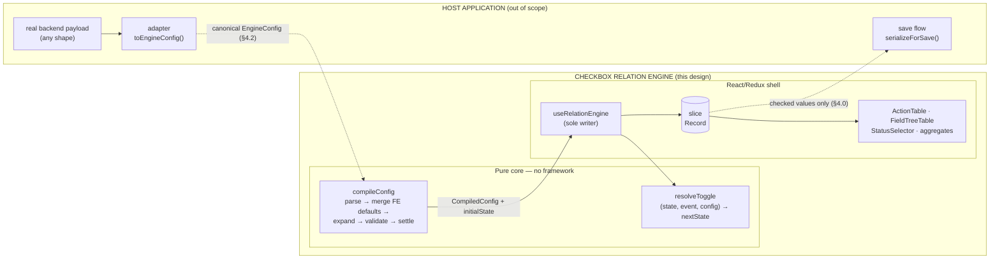
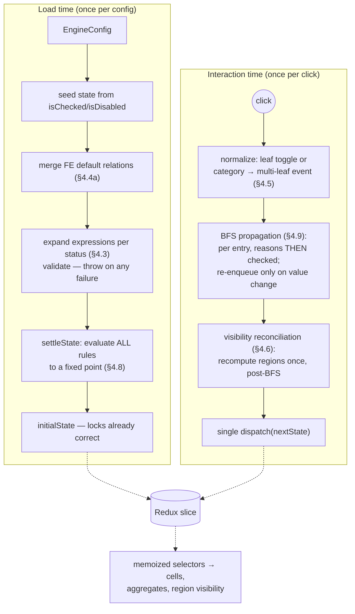

# Checkbox Relation Engine — Design Document v5

**Status:** Draft for review
**Date:** 2026-07-13
**Type:** Standalone Module Design (Revised — supersedes v4)

**Changes from v4:**

* **Rehomed as a standalone, host-agnostic module.** The outer rule-set CRUD module is out of scope entirely. Its place is taken by a **Host Contract** (§4.0): the engine consumes one canonical `EngineConfig` and exposes state + derived signals; everything else (fetching, page routing, dropdowns, save transport) belongs to the host.
* **Canonical input contract + adapter.** The ID grammar (§4.1) and config shape (§4.2) are now *this module's* published contract, not an assumption about a backend. A thin host-owned **adapter** maps the real payload into the canonical shape; payload-shape differences never touch the engine. This retires v4's two `TODO(verify)` gates as engine concerns — they become adapter concerns.
* **Implementation-proven mechanics promoted into the design** (they were discovered during the v4 build and previously lived only in code):
  * Load-time **settle pass** (§4.8) — every rule evaluated to a fixed point at compile time so dependency/visibility locks hold on *first render*.
  * **Reason-writes before checked-writes** ordering inside propagation (§4.9.3).
  * `restoreCheckedOnSatisfy` implemented via a paired **`@restore:<ruleId>` marker** in `disabledBy` (§4.4 card B).
  * `ENABLES_ON_*` pinned down as the **inverse-polarity mirror of `DISABLES_ON_*`** with its own reason (§4.4 card C), including the level-semantics equivalence table.
  * FE default rules **skip (not error)** when their source resolves to zero leaves (§4.4a).
* **New deep-reference sections** (the parts of the system that can hurt the product if misunderstood): full per-primitive contract cards (§4.4), the FE-owned **Relation Contract** (§4.4b), propagation & chaining semantics (§4.9), a **special-cases catalogue** (§4.11), and a **hazard register** (§8).

**Contents:** §1 Context · §2 Architecture · §3 Diagrams · §4 Interfaces & Contracts (4.0 host · 4.1 IDs · 4.2 config · 4.3 expressions · 4.4 primitives · 4.4a FE defaults · 4.4b relation contract · 4.5 derived aggregates · 4.6 visibility · 4.7 disabled reasons · 4.8 settle · 4.9 propagation & chaining · 4.10 types · 4.11 special cases · 4.12 worked example) · §5 Execution · §6 Performance & QA · §7 Open questions · §8 Hazard register

---

### 1. Context & Scope

* **Background:** The engine renders two checkbox surfaces — a flat **ACTION** table and a hierarchical **FIELD** tree with **VIEW**/**EDIT** columns — whose checkboxes drive each other through a **declarative relation config**. Content optionally varies by a **STATUS** label; all statuses' state coexists and is submitted together. The engine is a self-contained module: it defines the config contract, compiles it once, resolves every user interaction through one pure function, and hands the host a serializable result. The host decides where the config comes from and what "save" means.
* **Goals:**
  * **One canonical contract** (§4.1–§4.2): the engine's input shape is fixed and published; hosts adapt real payloads to it, never the reverse.
  * **Declarative relations** (§4.4): 12 primitives + a universal `condition`, compiled and validated at load; a config typo is a boot error, never a silent no-op.
  * **Target Expressions** (§4.3): positional wildcards + column aliases so rules can address whole columns or repeat across statuses without hand enumeration.
  * **Deterministic, testable core** (§4.9): `resolveToggle(state, event, config) → nextState` is pure; propagation terminates provably; conflicts resolve by a total ordering.
  * **Correct first render** (§4.8): dependency and visibility locks are established at compile time, not on first interaction.
  * **Reason-based disabling** (§4.7), **derived category aggregates** (§4.5), **region visibility** (§4.6), and the **FE default-config invariant layer** (§4.4a) — all carried forward from v4.
* **Non-Goals:**
  * Fetching, routing, resource pickers, save transport — host territory (§4.0).
  * Server-side rule evaluation; undo/redo; virtual scrolling *(consequence in §6)*.
  * **Cross-status relations** — a relation never links checkboxes in different statuses (§4.3).
  * Region-scoped hiding (whole FIELD table only), "exactly one"/"at least N" group constraints, intra-`path` matching (§7).

### 2. Architecture & Component Boundaries

Strict **pure-core / shell** split, with the host outside both:

* **Pure core** (`core/**`, framework-free): ID parser, config compiler (seed → merge FE defaults → expand expressions → validate → adjacency → settle), and `resolveToggle`. No store access, no React, no side effects; unit-tested over plain objects.
* **Shell** (store + hooks + components): a Redux slice `Record<LeafId, CheckboxValue>` keyed by the **full four-segment ID** (so STATUS namespaces itself and all statuses coexist); `useCheckboxConfig` (compile once, throw on invalid); `useRelationEngine` — the **only writer**: one `getState()`, one `resolveToggle`, one `dispatch` per interaction. Presentational tables render from memoized selectors (`selectCheckboxById`, `selectCategoryState`, `selectFieldTableVisible`).
* **Single write path (load-bearing):** invariant-style relations (`INVERSE`, `BIDIRECTIONAL`), the `"@hidden"` lock, and the EDIT⇒VIEW defaults hold **only** if every mutation flows through the engine. The slice's write action is not exported beyond the adapter hook; a host that writes checkbox state directly voids every guarantee in §4.4b.
* **Category clicks are normalized, never propagated as nodes:** an aggregate cell click becomes a multi-leaf `ToggleEvent` over that category's descendant leaves in that column; categories and headers have no state and no adjacency presence (§4.5).

### 3. Essential Diagrams

#### High-Level Architecture — *structural*

*What this shows: the module boundary — what the host owns vs. what the engine owns, and the single seam (adapter in, serialized state out) between them.*
*Legend: solid = synchronous call; dashed = data shape crossing a boundary.*



**Notice:** the engine never sees the real payload — the adapter is the *only* place payload-shape differences live. And the host never sees `disabledBy` — save serializes checked values only.

#### State & Data Flow — *behavioral*

*What this shows: the two lifecycles — compile-time (once per config) and interaction-time (once per click) — and where the single store write happens.*
*Legend: solid = call; dashed = dispatch/selector.*



**Notice:** `settleState` and `resolveToggle` share the same propagation core — first render and every later interaction obey identical semantics. There is exactly one dispatch per click regardless of cascade size.

### 4. Interfaces & Contracts

#### 4.0 Host Contract

The seam between the host and the engine, stated as obligations:

**The host MUST provide:**
* One `EngineConfig` (§4.2) per mounted page, produced by a host-owned **adapter** from whatever the real backend sends. The adapter is the anti-corruption layer: delimiter differences, flat-vs-keyed status packaging, extra fields — all absorbed there.
* A mount point for the page container and (if saving) a call to `serializeForSave(state)`.

**The engine guarantees to the host:**
* Compile-time validation — an invalid config **throws at load** with an actionable message; no invalid config ever reaches interaction time.
* Exactly one store commit per user interaction; deterministic results (§4.9.4) for identical `(state, event, config)`.
* A first render whose locks and visibility already satisfy every rule (§4.8).
* A serialization surface that emits **`{ id, isChecked }` pairs only** — `disabledBy` (including reserved reasons and `@restore:*` markers) is FE runtime state and **never leaves the module**.

**The host MUST NOT:**
* Write to checkbox state through any path other than the engine's toggle handlers (voids §4.4b guarantees).
* Interpret or split the `path` segment of an ID — it is opaque payload for a downstream consumer (§4.1).
* Persist `disabledBy` or rehydrate saved state without re-running `compileConfig` — locks are always derived from config + checked state, never stored (§8, H2).

#### 4.1 Canonical ID Grammar

All checkbox IDs are **slash-delimited, fixed four-position**:

```
Id           ::= resourceName "/" status "/" type "/" path
resourceName ::= segment                        // constant for a given page
status       ::= segment                        // single implicit status if the page has none
type         ::= "ACTION" | "VIEW" | "EDIT"
path         ::= <opaque string>                // passthrough payload; MAY contain "." or "/"
segment      ::= [A-Za-z0-9_-]+
```

**Examples:** `AI_FEATURE/IN_PROGRESS/VIEW/properties.name` · `AI_FEATURE/IN_PROGRESS/EDIT/properties.name` · `AI_FEATURE/IN_REVIEW/ACTION/export`

**Parsing rules (normative):**
* Parse by **fixed position**: split on the first three `/`; everything after the third `/` is `path`, verbatim. `path` may therefore itself contain `/` or `.` without ambiguity.
* **`path` is atomic and opaque.** The engine never splits, globs, or interprets it. Hierarchy lives only in the FIELD tree's `children` nesting (§4.2), never in the ID.
* `type` fixes table/column membership: `ACTION` → ACTION table; `VIEW`/`EDIT` → the corresponding column of a FIELD leaf.
* A field leaf's VIEW and EDIT checkboxes **share `resourceName`, `status`, and `path`, differing only in `type`** — the pivot the EDIT ⇒ VIEW invariant turns on (§4.4a).

> **Adapter note:** if the host's real IDs differ (different delimiter, extra segments, no status), the adapter rewrites them into this grammar on the way in and back on the way out of `serializeForSave`. The engine's grammar does not bend.

#### 4.2 Canonical Config Contract

One `EngineConfig` carries **every status's content**, keyed by status (all statuses save together, so there is no per-status fetch):

```typescript
interface LeafConfig {
  id: LeafId;            // conforms to §4.1
  isChecked: boolean;    // default checked state
  isDisabled: boolean;   // default disabled → seeds disabledBy: ["@initial"]
}

interface FieldCategoryNode { isCategory: true;  name: string; children: FieldNode[]; }
interface FieldLeafNode     { isCategory: false; name: string; view: LeafConfig; edit: LeafConfig; }
type FieldNode = FieldCategoryNode | FieldLeafNode;

interface StatusContent {
  status: string;                      // matches the STATUS segment of its ids
  action: LeafConfig[];                // flat ACTION table
  field: FieldNode[];                  // FIELD tree (categories → leaves); may be []
}

interface EngineConfig {
  resourceType: string;
  resourceName: string;
  statuses: string[];                  // ordered labels; length ≤ 1 ⇒ no status selector
  content: StatusContent[];            // exactly one entry per status
  relations?: RelationRule[];          // §4.3/§4.4 — authored with wildcards
  visibility?: VisibilityBinding[];    // §4.6
  selectors?: NamedSelector[];         // §4.3
}
```

**Seeding:** each `LeafConfig` becomes `state[id] = { checked: isChecked, disabledBy: isDisabled ? ["@initial"] : [] }`. Category nodes contribute **no** state. Load-time rejects: an id whose `status`/`type` segments disagree with where it sits in the payload; duplicate ids; a field leaf whose `view`/`edit` paths differ.

> **Adapter note (the v4 "shape B" question, resolved):** if the real backend sends one flat list with STATUS baked into each id, the adapter groups by the STATUS segment and emits `content: StatusContent[]`. The engine is identical either way because state is keyed by the full ID.

#### 4.3 Target Expressions

Small, positional, fully analyzable at load. Expressions **never exist at runtime** — they compile to concrete leaf-ID lists inside `compileConfig`.

| Form | Meaning | Semantics |
|---|---|---|
| Concrete ID | One specific leaf | Exact match |
| **Positional wildcard** `R/S/T/P` with `*` in any position | Every leaf matching the fixed positions | Per-segment equality; `*` matches that **whole** segment (for `path`, the entire opaque path — never a sub-part) |
| `$ACTION` / `$VIEW` / `$EDIT` | Column aliases | Sugar for `*/*/ACTION/*` etc. |
| `$SELECTOR(name)` | Named expression from the `selectors` block | Resolved by name; selectors may **not** reference other selectors |

**Relative wildcard binding (the load-bearing rule):** when a wildcard **source** expands, each `*` position **binds** to a concrete value per matched leaf; a `*` in the **target at the same position inherits** the bound value. `sourceId: "*/*/EDIT/*"` with `targets: ["*/*/VIEW/*"]` pairs each `R/S/EDIT/P` with exactly `R/S/VIEW/P`. A target `*` with **no** wildcard counterpart in the source expands to *all* values — an intentional fan-out (see §8, H5 before authoring one).

**Statuses never cross (enforced by construction):** the `status` position always binds source → target, so a wildcard rule expands to independent per-status edges. A target pinning a *different* concrete status than a concrete source is a **load-time error**.

**Load-time validation (all throw):** unknown alias/selector · malformed ID shape · `type` outside `ACTION|VIEW|EDIT` · an expression resolving to **zero** leaves (exception: `fe.*` defaults, §4.4a) · a cascade/symmetry rule whose source set intersects its own target set (self-loop) · a cross-status pin · a category named as source or target (§4.5).

#### 4.4 Relation Primitives — full contract cards

**12 primitives** (11 behaviors + 1 alias) in three categories, plus the universal `condition`. Relations link **checkboxes to checkboxes only** — never a category, never a column header.

Two cross-cutting facts to internalize before the cards:

1. **Edge-triggered vs. level-held.** Category A (checked-state) rules are **edge-triggered**: they fire when their trigger node *changes* and write once; they do not continuously re-assert. After "check Select All → items check", the user may freely uncheck an item; nothing re-checks it until Select All *changes* again. Categories B and C (dependency/disabled) are **level-held**: the lock reason is present *while* the driving condition holds, and the settle pass (§4.8) establishes it at load. Misreading an edge rule as an invariant is the single most common authoring error (§8, H12).
2. **Locks are cascade barriers.** Every checked-write **skips a target whose `disabledBy` is non-empty**, with exactly one exception: the rule that owns the lock may write through it (`forceCheckedValue`, the `REQUIRES` restore). Chains therefore *stop* at locked leaves (§4.9.5).

##### A. Checked-state relations — *source's `checked` drives targets' `checked`* (edge-triggered)

| Primitive | Trigger | Effect | On the opposite edge |
|---|---|---|---|
| `CASCADES_CHECK` | source becomes **checked** | all targets → checked | source unchecked ⇒ **no-op** (targets keep their state) |
| `CASCADES_UNCHECK` | source becomes **unchecked** | all targets → unchecked | source checked ⇒ no-op |
| `CASCADES_BOTH` | source changes either way | targets mirror the source | — |
| `GROUP_ALL` | *alias of `CASCADES_BOTH`* | identical; readability for "select all" headers | — |
| `MUTUAL_EXCLUSIVE` | source becomes **checked** | all targets → unchecked | source unchecked ⇒ no-op |
| `INVERSE` | source changes either way | targets := **NOT** source | — |
| `BIDIRECTIONAL` | **either** the source **or any target** changes | the other side mirrors it | — |

Card details:

* **`CASCADES_*` / `GROUP_ALL`:** the workhorse. Targets that are locked are skipped (barrier rule). Newly written targets enter the BFS queue and may trigger their own rules (§4.9). `GROUP_ALL` compiles to `CASCADES_BOTH` — same adjacency, same everything; use it only for authoring readability.
* **`MUTUAL_EXCLUSIVE`:** guarantees **at most one** checked, not exactly one — the group can be fully empty, and unchecking the winner elects nobody. It is *one-directional per declaration*: `A → [B, C]` only clears B/C when **A** is checked. For a true at-most-one group, declare the rule once per member (or use a wildcard whose expansion covers each member with the others as targets). A single declaration with a "hub" source is a half-built group — checking B will *not* clear A unless B has its own rule (§4.11, case 9).
* **`INVERSE`:** directional. Target mirrors the opposite of the source **when the source changes**; toggling the *target* directly does not touch the source. For a two-way inverse pair, declare `INVERSE` both ways — the pair is stable (A=¬B and B=¬A agree) and change-detection stops the ping-pong after one hop. Depends on the single-write-path rule (§2): a foreign writer can silently break the "always opposite" reading.
* **`BIDIRECTIONAL`:** the only category-A primitive triggered by its **targets** as well as its source. Declaring `A → B` auto-registers the mirror `B → A`; also declaring the mirror explicitly is redundant and the compiler **warns**. Converges in one extra hop by change-detection.

##### B. Dependency relation — *targets' state drives the **source*** (level-held; direction deliberately inverted)

* **`REQUIRES`** — source *requires* all targets (prerequisites):
  * **While any target is unchecked:** the source is forced **unchecked** and locked (`disabledBy` gains this rule's `id`). If the source was checked at the moment the lock landed **and** `restoreCheckedOnSatisfy: true`, a paired marker **`@restore:<ruleId>`** is pushed into `disabledBy` alongside the lock reason.
  * **When the last target becomes checked:** the rule removes its own reason *and* the marker; if the marker was present, the source is **restored to checked** in the same pass.
  * **Indexing:** triggered by **target** changes (not source clicks) — that's what makes it order-independent: prerequisites may be satisfied in any order.
  * **First render:** the settle pass (§4.8) means an initially-unsatisfied `REQUIRES` renders locked from the very first frame — without settle, the lock would only appear after the first interaction touching a prerequisite, which is a first-render correctness bug, not a cosmetic one.
  * **Marker mechanics:** the marker lives in `disabledBy` purely to keep `CheckboxValue` serializable (no extra field). It always coexists with the lock reason and is stripped with it; it is not itself a user-meaningful reason and must be filtered from any "why is this disabled" tooltip.
  * **Why not "EDIT requires VIEW":** `REQUIRES` *blocks* the source until prerequisites hold. The EDIT⇒VIEW business rule wants checking EDIT to *pull VIEW on*, not to block EDIT — that is two cascades (§4.4a). Choosing `REQUIRES` here would change the UX from "one click does both" to "one checkbox is dead until you click the other."

##### C. Disabled-state relations — *source's `checked` drives targets' `disabledBy`* (level-held)

| Primitive | Reason **present** while source is… | Reason removed when source is… |
|---|---|---|
| `DISABLES_ON_CHECK` | checked | unchecked |
| `DISABLES_ON_UNCHECK` | unchecked | checked |
| `ENABLES_ON_CHECK` | **un**checked | checked |
| `ENABLES_ON_UNCHECK` | checked | unchecked |

* All four carry optional **`forceCheckedValue`**: while the lock is held, targets are pinned to that boolean **through their own lock** (owner-bypass — the one exception to the barrier rule). Typical: `DISABLES_ON_CHECK` + `forceCheckedValue: false` = "read-only mode locks and clears Edit Content."
* **`ENABLES_*` is the inverse-polarity mirror of `DISABLES_*`** — read the table: `ENABLES_ON_CHECK` is level-equivalent to `DISABLES_ON_UNCHECK`, and `ENABLES_ON_UNCHECK` to `DISABLES_ON_CHECK`. Both names exist because authoring intent differs ("this unlocks that" vs. "this locks that") and because each rule's *reason id* is its own. **This equivalence is normative** — if an implementation's `ENABLES_*` does anything other than hold-its-own-reason-while-inactive / release-on-trigger, it is wrong.
* **A rule releases only its own reason.** `ENABLES_*` cannot strip another rule's reason, and *nothing* strips the reserved reasons `"@initial"` / `"@hidden"` (§4.7). Two rules locking one target release independently; the target enables only when `disabledBy` is empty.
* **First render:** by settle (§4.8), a target whose enabling condition is initially unmet renders locked from frame one.

##### Universal `condition` field

Any relationship may declare `condition`, evaluated against **current checked state** at fire time:

```typescript
type Condition =
  | string                      // shorthand for { all: [id] }
  | { all: LeafId[] }
  | { any: LeafId[] }
  | { not: Condition };
```

* **Gating:** when the rule's trigger fires and the condition is **false**, the rule does nothing (for level-held rules: behaves as if the driving level were inactive, i.e. its reason is released).
* **Re-firing:** conditioned rules are **also indexed by every id the condition references**. When a condition input changes, the rule re-evaluates against the source's *current* state — so "check Send Report while Reports Enabled is off, then enable reports" still cascades. Order-independent by construction.
* Condition ids must exist (load-time error otherwise) and are subject to the same never-cross-status rule.

#### 4.4a FE Default-Config Invariant Layer

The universal invariant **"EDIT implies VIEW (same path)"** ships as declarative **frontend default config**, merged with the incoming `relations` at load — not hardcoded imperative logic (invisible, unoverridable), not N-per-path network payload:

```json
[
  { "id": "fe.edit-checks-view",  "sourceId": "$EDIT",
    "relationships": [ { "id": "fe.edit-checks-view",  "type": "CASCADES_CHECK",   "targets": ["$VIEW"] } ] },
  { "id": "fe.view-unchecks-edit", "sourceId": "$VIEW",
    "relationships": [ { "id": "fe.view-unchecks-edit", "type": "CASCADES_UNCHECK", "targets": ["$EDIT"] } ] }
]
```

Via relative binding (§4.3) each concrete EDIT pairs with the VIEW at the identical path. Net behavior: **check EDIT ⇒ its VIEW checks; uncheck VIEW ⇒ its EDIT unchecks**; uncheck EDIT leaves VIEW; check VIEW alone is inert.

**Merge & precedence (load time):**
* FE defaults merge **first**; incoming `relations` apply on top.
* An incoming rule with the **same `id`** as an FE default **overrides** it — the per-resource opt-out/customization mechanism.
* `fe.*` is a **reserved namespace**: a non-`fe.*`-origin rule shadowing an `fe.*` id draws a compiler warning (intentional overrides use the exact id; accidental squatting gets flagged).
* **Zero-leaf exemption:** uniquely for `fe.*` rules, a source expanding to zero leaves is **skipped, not an error** — a resource with no FIELD tree must still compile. Every non-`fe.*` zero-leaf expression remains a hard error.
* The merged, expanded rule set is what compiles into the adjacency index — the invariant is inspectable in the compiled config, not buried in code.

#### 4.4b The Relation Contract (FE-owned)

**The frontend defines relation semantics; config authors supply data conforming to them.** This section is the single source of truth for that split — the thing both sides point at when behavior is disputed.

**The engine (FE) owns and guarantees:**

| Guarantee | Meaning |
|---|---|
| **Semantics** | What every primitive in §4.4 *does* is defined here, versioned with this document — never renegotiated per resource or per config |
| **Termination** | Any valid config terminates on any event sequence (§4.9.2); no config can hang the page |
| **Determinism** | Identical `(state, event, config)` ⇒ identical result; conflicts resolve by the total order in §4.9.4 |
| **Atomicity** | One interaction = one commit; intermediate propagation states are never observable |
| **Status isolation** | No rule effect ever crosses a status boundary |
| **Fail-fast validation** | Every malformed config throws at load with an actionable message — never a silent partial compile |
| **First-render consistency** | Locks/visibility satisfy all rules before the first paint (§4.8) |

**Config authors (typically the backend) must:**
* Use only relation `type` values from the published enum (§4.10). **An unknown type is a load-time error, not an ignored rule** — silently dropping a rule the author believed was protecting an invariant is how bad data gets saved (§8, H6).
* Give every relationship a **unique, stable `id`** — ids are lock reasons (user-visible via tooltips), override keys (§4.4a), and error-message anchors.
* Reference **checkboxes only** — never categories or headers (§4.5).
* Never author cross-status edges, `@`-prefixed reasons, or ids in the `fe.*` namespace (all load-rejected/warned).
* Treat this contract as **versioned**: additions (new primitives, new fields) bump the contract version; the engine rejects a config declaring a newer version than it implements, rather than guessing.

**Explicitly not promised:** rules re-asserting outside their trigger (edge vs. level, §4.4 fact 1); enforcement against writes that bypass the engine (§2); any interpretation of `path`.

#### 4.5 Categories & Column Headers Are Derived, Never Stored

Categories/headers have **no `CheckboxValue`**, never appear in the slice, and are **not adjacency nodes**.

* **Rendering:** `selectCategoryState` derives per column — `checked` (all descendant leaves checked), `indeterminate` (some), `disabled` (all disabled) — from the compiled tree's stable child-ID lists, never a caller-supplied array.
* **Clicking an aggregate cell:** normalized into a multi-leaf `ToggleEvent` (checked/indeterminate → uncheck all descendants in that column; unchecked → check all); already-disabled descendants are skipped at normalization; BFS proceeds from the written leaves normally.
* **In config:** a category is not a legal `sourceId` or target (validation rejects). "All fields in a column" is `$VIEW`/`$EDIT` or a wildcard — not a category name.

#### 4.6 Region Visibility (FIELD table show/hide)

Several ACTION checkboxes jointly govern whether the **entire FIELD table** is shown. **Not a relation primitive** (single-source primitives can't express group-OR cleanly) — a first-class binding:

```typescript
interface VisibilityBinding {
  region: 'FIELD';                 // v5: whole FIELD table is the only region
  controlledBy: TargetRef[];       // ACTION ids/expressions; expanded per status at load
  showWhen: 'anyChecked';          // visible ⟺ at least one controller checked
  whenHidden: 'clearAndLock';      // hiding force-unchecks + locks every field leaf
}
```

**Semantics (independent per status):**
* **Visible ⟺ any controller checked**; hides only when **all** controllers are unchecked.
* **On hide:** every FIELD leaf (VIEW and EDIT) is force-unchecked and gains the reserved reason **`"@hidden"`**. The lock makes hidden fields resist any stray cascade.
* **On show:** `"@hidden"` is removed everywhere; fields come back **empty** — nothing auto-checks, because cascades fire only on a toggle *to checked* and reshow writes no checked-values.
* **Reconciliation pass:** `resolveToggle` runs the BFS to its fixed point, **then** recomputes each region from its controllers' final state and applies hide/show writes. Because hiding writes only terminal values (unchecked + locked) and locked leaves are cascade barriers, the pass cannot restart propagation — it runs exactly once, O(field leaves).
* **Validation:** every `controlledBy` entry must resolve to ≥ 1 **ACTION** leaf; a VIEW/EDIT controller is a load-time error.
* A controller may simultaneously be a relation source/target; relations settle first, visibility reconciles after — that ordering *is* the semantics (§4.11, case 12).

#### 4.7 Disabled State: Reasons, Not a Flag

```typescript
interface CheckboxValue {
  checked: boolean;
  disabledBy: string[];   // rule ids + reserved entries; disabled ⟺ length > 0
}
```

* Multiple rules lock one target independently; each releases only its own reason; cross-rule clobbering is structurally impossible.
* **Reserved entries** (no rule can remove them):
  * `"@initial"` — backend-supplied default lock (`isDisabled: true`); irrevocable for the page's lifetime.
  * `"@hidden"` — held while the leaf's region is hidden; removed only by the visibility pass.
  * `"@restore:<ruleId>"` — the `REQUIRES` restore marker (§4.4 card B); paired with its rule's lock reason, stripped together, filtered from user-facing reason displays.
* **Barrier policy (restated as normative):** propagation checked-writes skip any leaf with non-empty `disabledBy`; only the lock-owning rule writes through its own lock. A future cascade-through-locks need is an explicit per-rule `piercesDisabled` opt-in, never a weakened default (§7).
* Plain string array — Redux-serializable; ids/reasons unique, so array semantics suffice.

#### 4.8 Load-Time Settle Pass

After seeding and compiling, **`settleState` primes every node ID through the same propagation core** used by `resolveToggle` and iterates to a fixed point. The result is the module's `initialState`.

**Why this is load-bearing and not an optimization:**
* `REQUIRES` triggers on *target* changes; nothing "changes" at load, so an initially-unsatisfied dependency would render **unlocked and possibly checked** until the first interaction happened to touch a prerequisite.
* Same for `DISABLES_*`/`ENABLES_*` whose driving level is already active in the seeded data, and for a region whose controllers all start unchecked.
* Settle uses the identical propagation semantics as interaction time (same ordering, same barriers, same tie-breaks) — first render is not a special case with its own bugs.
* Settle happens **once per compile**, in memory, before any React mounts; a config whose rules cannot reach a fixed point is caught here (cap + throw), at load, instead of on some user's fifteenth click.

#### 4.9 Propagation, Chaining & Conflict Resolution

The heart of the engine. All of §4.4's primitives reduce to entries in one **adjacency index**, walked by one BFS.

##### 4.9.1 The adjacency index

Compiled per concrete leaf: `triggersFor(leafId)` returns every rule entry that must re-evaluate when that leaf changes —
* cascade/`MUTUAL_EXCLUSIVE`/`INVERSE` entries: indexed by their **source**;
* `BIDIRECTIONAL`: indexed by source **and** every target;
* `REQUIRES`: indexed by its **targets** (prerequisites) only;
* every conditioned rule: additionally indexed by **each id its condition references**.

##### 4.9.2 The BFS and its termination invariant

Seed the queue with the user-toggled leaf/leaves. Dequeue a leaf → look up its entries → compute each entry's effect against **current working state** → apply writes → **any leaf whose `CheckboxValue` actually changed (`checked` AND `disabledBy` compared) is enqueued**; an unchanged leaf is not. That single rule is the termination proof: state space per leaf is finite, and re-enqueue requires a change, so the intentionally circular constructs (`INVERSE` pairs, `BIDIRECTIONAL`, EDIT⇒VIEW's two cascades) converge in one extra hop instead of oscillating. A hard cap of **10 × leafCount** iterations backstops the invariant; hitting it throws an `EngineError` carrying the offending cycle's trace in dev builds.

##### 4.9.3 Write ordering inside one entry (normative)

For each fired entry, apply **reason-writes before checked-writes**. Rationale: a `REQUIRES` release must strip its lock *before* its restore write, or the barrier guard (skip-if-disabled) silently drops the restore — the source stays unchecked forever despite `restoreCheckedOnSatisfy: true`. The ordering is safe for every other primitive because forced writes use owner-bypass. **An implementation that applies checked-writes first has a real, user-visible bug that only manifests on `REQUIRES` + restore** — the exact kind of defect a naive reimplementation reintroduces.

##### 4.9.4 Conflict resolution — the total order

Within one BFS pass, if two entries write conflicting values to the same leaf:

1. **Higher `priority` wins** (integer, default `0`; a direct user toggle is priority 0).
2. Tie → the write originating **closer to the user's event** (shallower BFS depth) wins.
3. Full tie → **config declaration order** (FE defaults precede incoming relations).

Total, hence deterministic in all cases. Note the sharp edge: relying on rung 3 means authoring order is semantics — prefer explicit `priority` whenever two rules can legitimately collide (§8, H10).

##### 4.9.5 Chaining semantics

Chains are the *point* of the design — and where products get hurt. Normative behaviors:

* **Chains cross categories freely.** Example: check `A` → `CASCADES_CHECK` checks `B` → `B`'s change triggers `DISABLES_ON_CHECK` locking + force-unchecking `C` → `C`'s change triggers `CASCADES_UNCHECK` unchecking `D` — arbitrary depth, one BFS, one commit.
* **Locks are chain barriers.** If `C` above were already locked by *another* rule, the force-uncheck from this rule **skips** it and the chain does not continue through `C`. A chain's reach is therefore state-dependent — test chains against locked intermediate states, not just the happy path.
* **Diamonds are resolved, not raced.** `A → B`, `A → C`, and both `B`,`C` writing `D` with different values resolves by §4.9.4 — never by map iteration order or rule registration accidents.
* **Level-held rules re-evaluate mid-chain.** A cascade that flips a `DISABLES_*` source mid-pass applies/releases that lock in the same pass; the visibility pass still runs only once, after the fixed point.
* **Conditions read working state.** A condition consulted mid-chain sees the values as-of that moment in the pass (current working state), not the pre-click snapshot — consistent with re-fire-on-input-change semantics.
* **Nothing re-fires without a change.** A rule whose effect writes the values already present contributes no new queue entries — idempotence is observable: replaying the final event of any sequence changes nothing (property-tested, §6).

#### 4.10 TypeScript Definitions

```typescript
type ColumnType = 'ACTION' | 'VIEW' | 'EDIT';
type LeafId = string;                 // "RESOURCE/STATUS/TYPE/PATH", grammar §4.1

// ----- Target expressions (§4.3) -----
type ColumnAlias = '$ACTION' | '$VIEW' | '$EDIT';
type TargetExpression = string | ColumnAlias | `$SELECTOR(${string})`;
type TargetRef = LeafId | TargetExpression;
interface NamedSelector { name: string; expression: TargetExpression; }

// ----- Relations (§4.4) -----
type CascadeType  = 'CASCADES_CHECK' | 'CASCADES_UNCHECK' | 'CASCADES_BOTH' | 'GROUP_ALL';
type SymmetryType = 'MUTUAL_EXCLUSIVE' | 'INVERSE' | 'BIDIRECTIONAL';
type DisableType  = 'DISABLES_ON_CHECK' | 'DISABLES_ON_UNCHECK'
                  | 'ENABLES_ON_CHECK'  | 'ENABLES_ON_UNCHECK';
type RelationType = CascadeType | SymmetryType | 'REQUIRES' | DisableType;

type Condition = string | { all: LeafId[] } | { any: LeafId[] } | { not: Condition };

interface RelationBase {
  id: string;                         // REQUIRED — reason key, override key, error anchor
  targets: TargetRef[];
  condition?: Condition;
  priority?: number;                  // §4.9.4; default 0, higher wins
}
type RelationDefinition =
  | (RelationBase & { type: CascadeType | SymmetryType })
  | (RelationBase & { type: 'REQUIRES'; restoreCheckedOnSatisfy?: boolean })
  | (RelationBase & { type: DisableType; forceCheckedValue?: boolean });

interface RelationRule {
  id?: string;                        // rule-level id (FE-default merge/override, §4.4a)
  sourceId: TargetRef;                // expression sources expand statically per status
  relationships: RelationDefinition[];
}

// ----- Visibility (§4.6) -----
interface VisibilityBinding {
  region: 'FIELD';
  controlledBy: TargetRef[];
  showWhen: 'anyChecked';
  whenHidden: 'clearAndLock';
}

// ----- Config (§4.2) -----
interface LeafConfig { id: LeafId; isChecked: boolean; isDisabled: boolean; }
interface FieldCategoryNode { isCategory: true; name: string; children: FieldNode[]; }
interface FieldLeafNode { isCategory: false; name: string; view: LeafConfig; edit: LeafConfig; }
type FieldNode = FieldCategoryNode | FieldLeafNode;
interface StatusContent { status: string; action: LeafConfig[]; field: FieldNode[]; }

interface EngineConfig {
  resourceType: string;
  resourceName: string;
  statuses: string[];
  content: StatusContent[];
  relations?: RelationRule[];
  visibility?: VisibilityBinding[];
  selectors?: NamedSelector[];
}

// ----- Runtime state -----
interface CheckboxValue { checked: boolean; disabledBy: string[]; }
type CheckboxState = Record<LeafId, CheckboxValue>;

// ----- Engine events (§2, §4.5) — what the shell feeds resolveToggle -----
type ToggleEvent =
  | { kind: 'leaf'; id: LeafId; checked: boolean }                 // one checkbox click
  | { kind: 'leaves'; writes: { id: LeafId; checked: boolean }[] } // normalized category-aggregate click

// ----- Save surface (§4.0) — the only thing that leaves the module -----
interface SavedLeaf { id: LeafId; isChecked: boolean; }
declare function serializeForSave(state: CheckboxState): SavedLeaf[];  // never emits disabledBy
```

#### 4.11 Special-Cases Catalogue

Each case: the scenario, the **defined** behavior, and why. If an implementation disagrees with a row, the implementation is wrong (or this document needs a reviewed amendment) — there is no third option.

| # | Scenario | Defined behavior | Why |
|---|---|---|---|
| 1 | Toggle event for a **disabled leaf** | Engine no-ops (UI shouldn't emit it; engine guards anyway) | Locks must not be user-bypassable |
| 2 | Toggle to the **value already held** | No-op; no rules fire | Change-detection is the trigger definition |
| 3 | A **locked leaf's value changes** via owner-bypass (force/restore) | Its change **does** propagate to rules triggered by it | Rules fire off state changes, regardless of who caused them |
| 4 | **Category aggregate click** with some descendants disabled | Disabled descendants excluded at normalization; the rest toggle | Aggregates never bypass locks |
| 5 | Cascade targets a **hidden** field leaf | Skipped — `"@hidden"` is a barrier | Hidden state must be inert and empty |
| 6 | Region **reshown** | `"@hidden"` stripped; everything comes back **unchecked**; no cascade fires | Reshow writes no checked-values; edge rules need an edge |
| 7 | Expression resolves to **zero leaves** | Load error — except `fe.*` default rules, which are skipped | A typo must not silently disable a business rule; but resources without fields must compile |
| 8 | **Self-loop** (source ∈ targets) on cascade/symmetry types | Load error | Meaningless and a cycle seed. (`REQUIRES` self-reference is likewise rejected as ill-formed) |
| 9 | `MUTUAL_EXCLUSIVE` authored as a single hub rule | Legal, but only the hub's checking clears others — **not** a symmetric group | At-most-one across a set requires per-member declarations; document-level warning, not an error |
| 10 | `BIDIRECTIONAL` declared in **both** directions | Second declaration is redundant; compiler warns; behavior unchanged | Auto-mirroring already covers it |
| 11 | Two rules lock the same target; one releases | Target stays disabled until `disabledBy` is empty | Reasons are independent by design |
| 12 | A leaf is **both** a visibility controller and a relation source/target | Relations settle first (BFS), visibility reconciles after — hide wins over any same-pass cascade into the region | Fixed ordering is the only deterministic answer |
| 13 | Backend sends `isDisabled: true` and a rule targets that leaf | `"@initial"` never releases; rule writes skip it (barrier); rule reasons may stack on top and release independently | Backend-decreed locks outrank all rules |
| 14 | **Unknown relation `type`** / unknown config fields that carry semantics | Load error (unknown type); unknown *extra* data fields are ignored by the adapter boundary | Never silently drop a rule an author relied on |
| 15 | `condition` references a **nonexistent id** | Load error | A condition that can never be evaluated is a typo |
| 16 | `condition` references an id in **another status** | Load error (cross-status rule applies to conditions too) | Status isolation is total |
| 17 | Duplicate relationship **ids** in incoming config | Load error (duplicates); same-id override of an `fe.*` default is the sanctioned exception | Ids are reason keys — collisions corrupt lock bookkeeping |
| 18 | Save while region hidden / leaves locked | Serialization emits current `checked` values (hidden ⇒ `false`); `disabledBy` never serialized | What you see (cleared) is what you save; locks are derived state |
| 19 | `statuses` list and `content` entries disagree | Load error (missing or extra status content) | Guessing which side is right corrupts the whole page |
| 20 | Empty FIELD tree for a status (`field: []`) | Legal; FIELD section not rendered; `fe.*` defaults skip (case 7); visibility bindings targeting FIELD with no leaves are legal no-ops | ACTION-only resources exist |

#### 4.12 Worked Example — "EDIT implies VIEW", end to end

The canonical invariant, exactly as merged by §4.4a. `$EDIT` expands to every concrete `R/S/EDIT/P`; its target `$VIEW` inherits the bound `R`, `S`, `P`, yielding exactly `R/S/VIEW/P` — `AI_FEATURE/IN_PROGRESS/EDIT/properties.name` pairs with `AI_FEATURE/IN_PROGRESS/VIEW/properties.name`, never a different status or path.

Resulting behavior: checking any EDIT auto-checks its sibling VIEW; unchecking any VIEW auto-unchecks its sibling EDIT; unchecking EDIT leaves VIEW; checking VIEW alone is inert. This doubles as the acceptance test for wildcard binding, FE-default merge, and change-detection termination (the two cascades reference each other's columns and provably cannot oscillate: the second hop always writes an already-held value).

### 5. Execution Strategy

1. **Adapter first:** obtain 3–5 real payloads; write `toEngineConfig()` + `serializeForSave()` against them. Every real-world shape question (delimiters, flat-vs-keyed statuses, extra fields) is answered *here*, in one file, with fixture tests. The engine's contract does not move.
2. **Pure core bottom-up:** ID parser (§4.1) → seeding + tree normalization (§4.2) → expression compiler with full validation (§4.3) → FE-default merge (§4.4a) → effects + adjacency + `resolveToggle` + settle (§4.4, §4.8, §4.9) — each layer fully tested over plain objects before the next, zero React anywhere.
3. **Shell:** slice + memoized selectors + `useRelationEngine` (single write path), then the presentational tables and event normalization (§4.5).
4. **Parity audit before cutover:** enumerate every relation the existing production behavior expresses (per resource + status) and encode each in config. Any behavior that cannot be expressed in §4.4 **blocks cutover** and comes back to this document as a proposed primitive — never as an inline hack in the shell.

### 6. Performance & Quality Assurance

* **Performance:** single commit per interaction (one `getState`, one `dispatch`, one React render). DSL compiles away at load; per-node lookup is a map hit; propagation is O(affected). Honest framing: a select-all or hide-clear over N leaves is O(N) work and O(N) DOM updates — efficient, not magic. Budget: 1,000-leaf full-column cascade completes engine work < 16 ms. Virtual scrolling remains a non-goal; revisit past ~1,000 visible leaves.
* **Testing strategy (each maps to a contract section):**
  * Pure unit tests of `resolveToggle`/`settleState` over plain objects — no store, no React (§4.9, §4.8).
  * **Property test:** random configs + random click sequences → always terminate, and are idempotent (replaying the final event changes nothing) (§4.9.2, §4.9.5).
  * Per-primitive behavior tests — one per §4.4 card, including the edge-vs-level distinction and both `restoreCheckedOnSatisfy` values.
  * The `ENABLES` ≡ inverse-`DISABLES` equivalence, asserted directly (§4.4 card C).
  * Write-ordering regression: `REQUIRES` + restore, which fails if checked-writes precede reason-writes (§4.9.3).
  * Wildcard binding: `$EDIT → $VIEW` pairs same-path/same-status only; foreign-status pins fail at load (§4.3).
  * FE-default merge: defaults present with no incoming relations; override by matching id; `fe.*` shadow warning; zero-leaf skip (§4.4a).
  * Tie-breaking determinism: priority → depth → declaration order (§4.9.4).
  * Chains at depth across primitive categories; chains stopping at locked barriers (§4.9.5).
  * Disabled semantics: barriers, owner-bypass, independent multi-lock release, foreign-reason immunity, reserved-reason irrevocability (§4.7).
  * Region visibility: hide clears + locks, reshow empty, cascade cannot resurrect a hidden leaf, OR semantics, per-status independence, controller-also-source ordering (§4.6, §4.11 case 12).
  * `condition` re-evaluation across input orders (§4.4).
  * Loader validation: **every** throw class in §4.3/§4.4b/§4.11 has a test asserting it throws with an actionable message.
  * §4.12 as the end-to-end acceptance test.
* **Accessibility:** aggregate cells expose `aria-checked="mixed"` + DOM `indeterminate`; disabled cells expose `aria-disabled` with a human-readable reason where one exists (reserved markers filtered); VIEW/EDIT cells carry column-disambiguated accessible names; FIELD show/hide and large cascades announce via `aria-live="polite"`; the status selector is a labelled tablist.

### 7. Open Questions & Future Considerations

* **Region-scoped hiding** — `region` is an enum so `{ region: 'SUBTREE', anchor }` can be added without reshaping the model.
* **Restore-on-reshow** — would need a pre-hide snapshot; add as explicit `whenHidden: 'clearAndRestore'`, never a default change.
* **Static conflicting-cycle lint at load** — runtime is safe (change-detection + cap + priority); a load-time fixed-point *warning* for rule pairs that fight is a fast-follow.
* **Non-checkbox condition inputs** (e.g. an RBAC role) — `Condition`'s shape admits later predicate kinds without breaking existing configs.
* **`GROUP_MIN(n)` / exactly-one semantics** — a new primitive, not a `MUTUAL_EXCLUSIVE` patch.
* **`piercesDisabled`** — explicit per-rule opt-in if an admin-grade cascade ever must cross locks.
* **Sighted-user cascade signaling** (flash/toast/changed-count) — open UX question; `aria-live` covers AT.

### 8. Hazard Register — what can hurt the product, and the guard for each

| # | Hazard | How it would hurt | Guard (and where it lives) |
|---|---|---|---|
| H1 | **Oscillating rule pair** (config authors fight: A checks B, B unchecks A) | Infinite loop → frozen page | Change-detection re-enqueue (§4.9.2) forces convergence; 10×leafCount cap throws with cycle trace; settle catches it at **load**, not on a user's click |
| H2 | **Persisted locks going stale** (state saved with `disabledBy`, config later changes, orphaned reason never releases) | Permanently dead checkboxes | `disabledBy` is never serialized (§4.0); locks are always re-derived by `settleState` from config + checked values |
| H3 | **Save/UI divergence** (hidden-cleared fields saved as checked, or vice versa) | Downstream module grants permissions the user can't see | Save reads engine state, which the visibility pass already cleared (§4.11 case 18); single write path means no unreconciled copy exists |
| H4 | **Cross-status leakage** (a rule in IN_REVIEW mutating IN_PROGRESS) | Corrupts a status the user isn't even looking at, discovered only after save | Impossible by construction (status always binds source→target) + explicit load error on cross-status pins/conditions (§4.3) |
| H5 | **Wildcard fan-out cross-product** (wildcard target with no bound source counterpart, e.g. every-EDIT → every-VIEW) | Accidental O(N²) edges: compile blow-up + absurd cascades | Relative binding is the default semantics (§4.3); compiler surfaces expanded edge counts; treat any fan-out > leaf count as an authoring smell in review |
| H6 | **Contract drift** (config author assumes semantics the engine doesn't have — e.g. expects `MUTUAL_EXCLUSIVE` to be symmetric, or an unknown type to "just work") | Business rule silently unenforced; bad rule-sets saved | §4.4b is the single source of truth; unknown types and malformed rules **throw at load**; §4.11 defines every ambiguous case |
| H7 | **First-render inconsistency** (locks/visibility only correct after the first click) | User checks something that should have been locked; saves it | `settleState` at compile (§4.8) — first frame already at fixed point |
| H8 | **Second writer to the slice** (host or future teammate dispatches directly) | Every invariant silently voidable; `INVERSE`/EDIT⇒VIEW/`@hidden` all break | Single write path (§2): write action not exported; Host Contract forbids it (§4.0); review rule: any new dispatch to this slice is a design change |
| H9 | **ID grammar drift** (payload IDs stop matching §4.1 — new delimiter, extra segment, `type` value) | Mis-parsed IDs scatter state under wrong keys | Fixed-position parse throws on malformed shape at load; adapter owns translation and its fixtures fail first (§5.1) |
| H10 | **Declaration-order-dependent behavior** (two rules colliding, resolved by rung 3 of §4.9.4) | Reordering a config array silently changes UX | Total order keeps it *deterministic*; authoring guidance: explicit `priority` whenever collision is legitimate; collision without explicit priority is a review flag |
| H11 | **`fe.*` namespace squatting** (backend accidentally ships a rule id starting with `fe.`) | Silently replaces a universal business invariant | Reserved namespace + compiler warning on non-default `fe.*` ids (§4.4a); intentional overrides are exact-id and reviewed |
| H12 | **Edge/level misreading** (author expects `CASCADES_CHECK` to *keep* targets checked forever) | "Bug" reports and hasty hacks that add real bugs | §4.4 fact 1 is explicit; per-card "on the opposite edge" column; tests assert the non-reassertion |
| H13 | **Restore-write regression** (a reimplementation applies checked-writes before reason-writes) | `restoreCheckedOnSatisfy` silently never restores | Normative ordering (§4.9.3) + a dedicated regression test that fails on the wrong order |
| H14 | **Reason-id instability** (backend regenerates relationship ids per fetch) | Locks from a stale id linger conceptually; overrides stop matching; tooltips meaningless | Contract requires stable unique ids (§4.4b); state is rebuilt per compile so runtime survives, but override/UX contracts demand stability — validate in the parity audit |
| H15 | **Giant cascade jank** (select-all over a huge tree) | Dropped frames on low-end devices | O(N) honesty in §6 + 16 ms budget test; virtual scrolling explicitly deferred with the revisit threshold stated |

---

*Supersedes v4 (`checkbox-relation-engine-design-v4.md`), which remains in the repo for history. The reference implementation of this design lives in `src/core/**` (pure core), `src/store` / `src/hooks` / `src/components` (shell), with the per-primitive demo configs in `src/demo/mockBackend.ts` and their regression tests in `src/demo/mockBackend.test.ts`.*
